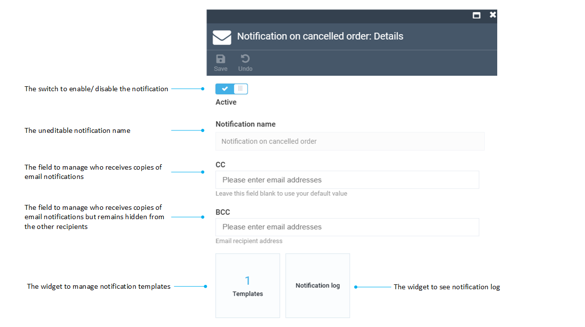

# Notification List

The notification list shows all existing notifications that are currently configured for your store. This includes all our out-of-the-box notifications, as well as your custom ones, if any. The icon to the right (**Type**) shows whether this is an email (mailbox icon) or a text message (message icon) notification:

!!! note
	Email and text message are two types of notifications Virto Commerce supplies by default. Your development team may configure other types that will notify your customers through other communication channels, such as messengers.

## Notification Details
Once you click any notification in the list, the ***Notification Details*** screen will show up. The way it looks like depends on the notification type:

+ Email notification:

+ Text message (SMS) notification:

### Email Notification Details
While the *Notification name* field is uneditable, you can provide emails for the ***CC*** and ***BCC*** fields and toggle the ***Active*** button, which activates or disables your notification.

!!! note
	Both the ***CC*** and ***BCC*** fields are provided for testing purposes only, e.g., when you want to see whether your email notification works correctly and can reach the specified addresses. In the production environment, the emails will be programmed to be sent to the relevant customer addresses, and you won't need to provide those manually.

### Text Notification Details
Text message notifications, logically, do not have the ***CC*** and ***BCC*** fields; instead, they provide you with an option to add a phone number, which is again for testing purposes only.

### Enabling/Disabling Notifications

1. To enable sending particular notifications, switch the **Active** option to on.

1. To disable sending particular notifications, switch the **Active** option to off.

## More Info
Apart from the fields described above, you also have two widgets to manage your notifications, [Templates](notification-templates.md) and [Notification log](notification-log.md), which we cover in the respective sections.