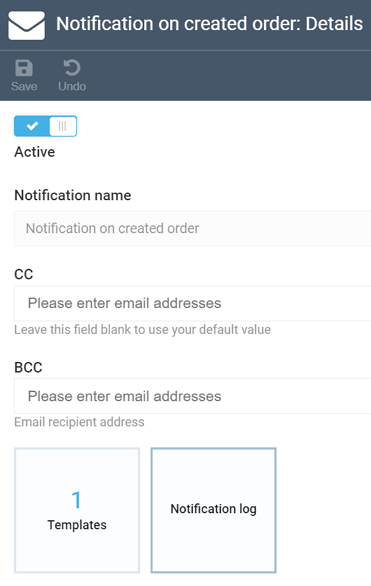
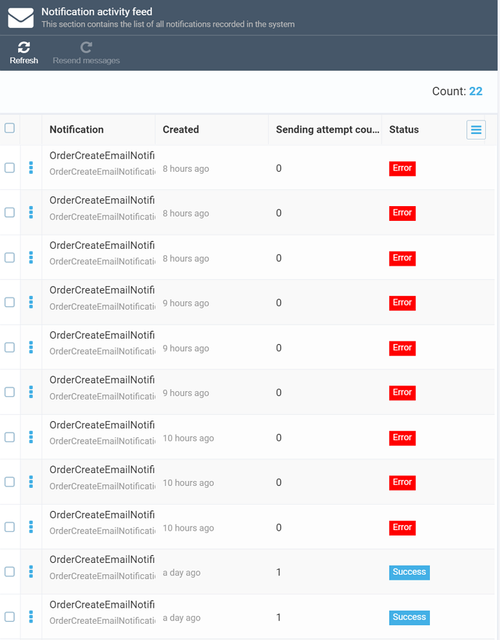

# Notification Log
Each notification allows you to see its log. To view it, click the relevant ***Notification log*** widget on the ***Notification Details*** screen:

Once you open the widget, you will see whether the notification was delivered successfully or failed when it was being sent:

## Notification Activity Feed

You can also use the ***Notification Activity Feed*** option on the module main screen, which displays whether the notifications succeeded or failed:

