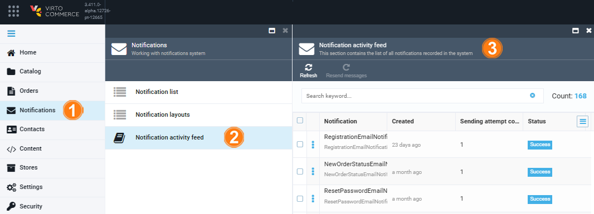

# Notification log

You can view a log of:

* A specific notification via the [Notification log](notification-log.md#notification-log) widget.
* All the notififcations sent via the [Notification activity feed](notification-log.md#notification-activity-feed).

## Notification log

To view the log of a specific notification:

1. In the main menu, click **Notifications**.
1. In the next **Notifications** blade, click **Notification list**.
1. In the next blade, select the required notification.
1. In the next blade, click on the **Notification log** widget.
1. The next blade shows whether the notification was delivered successfully or failed when it was sent.

## Notification activity feed

To view the log of all the notififcations sent:

1. In the main menu, click **Notifications**.
1. In the next **Notifications** blade, click **Notification activity feed**.
1. The next blade shows the notifications log.

{: width="800"}