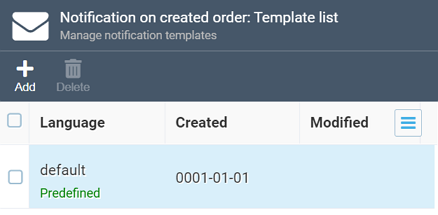

# Notification Templates

!!! note
	In this section, we cover email notifications as a type that is most popular and handy and has the most options available. Unlike email notifications, text message ones lack such options as ***Layout*** and ***Subject Line***, while their formatting is also very much limited. However, they do share other options with the email notification type.

The ***Templates*** widget shows the list of templates available for your notification:

!!! note
	The ***predefined*** label means that this notification template is supplied out of the box. If you make changes to it and then save it, it will be replaced with your changed version, but the system will warn you about it:
	
	
	
	You can, however, restore defaults any time by clicking the ***Restore*** button in the top toolbar.

Templates are, basically, containers that house all content for your notification, i.e. the message you are sending to your customer. For each template, you can set language, assign specific [layout](notification-layouts.md), and provide the subject line and the message itself:

!!! warning
	The only way to create a *new* template for the notification you are working with is creating one for another language. If you create a new template with the same language the current template has, e.g., ***default*** or ***EN-US***, it will override the current template.

As you can see, you can format your message with both HTML and Markdown, and then click the ***Preview*** button in the top toolbar to see how it will roughly look like:

Finally, you can provide sample JSON data to replace the variables with specific values in the preview:

