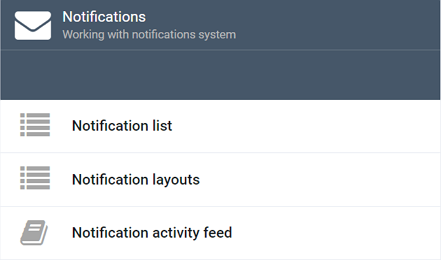

# Overview

Virto's *Notifications* module allows you to work with various notification scenarios for your customers.

!!! note
	While managing your online store, you will need to send notifications to your customers in various cases, e.g., when they successfully sign up, when they request password reset, or when their order is complete. For all such scenarios, the Notifications module will enable sending an email or other message informing your customers on the next steps they should take or just providing them with the required info.
	
!!! tip
	Virto Commerce provides a medley of notifications out of the box. Your development team can configure way more themselves, too.<!---link to dev_docs/creating_your_own_notification-->
	
## Key Features
The *Notifications* module has the following key features:

1. [Notification list](notification-list.md)
2. [Notification layout](notification-layouts.md)
3. [Notification activity feed](notification-log.md#notification-activity-feed)

