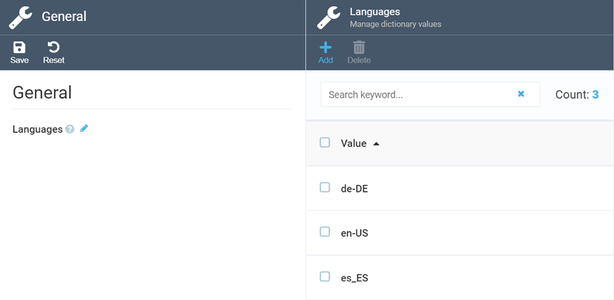

# Settings
This section covers the Notifications module settings.

## Language Settings

Currently, the only settings you can configure for the Notifications module are language settings. To do so:

+ Go to *Settings -> Notifications -> General*.
+ Click the pensil icon near the ***Languages*** option.
+ Add or delete languages as required:

