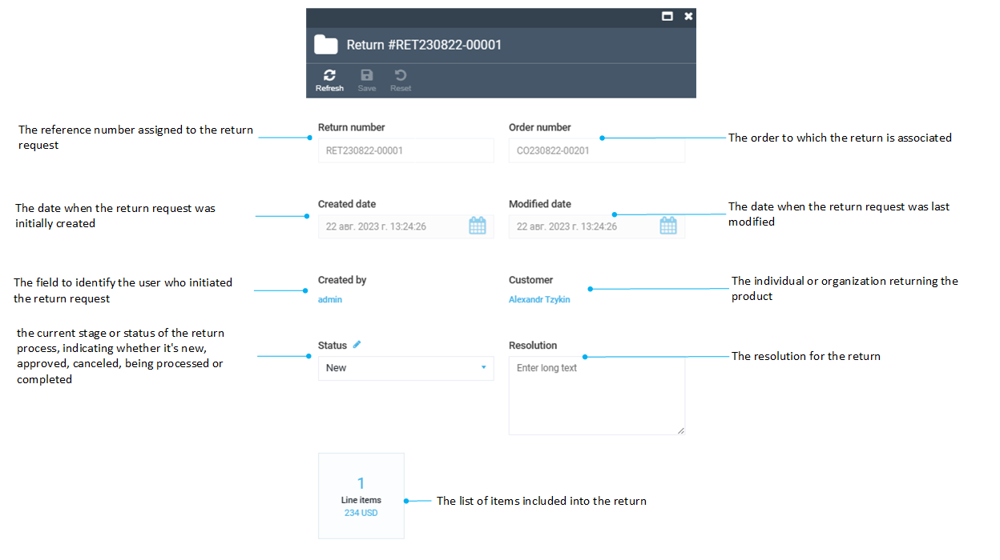

# Creating Returns

To create a return for a particular order:

1. Select the order and click **Create return**.
1. In the new blade, check the items that require a return. Enter the return reason, if necessary.
1. Click **Make return**.

1. The return specifications opens in a new blade.

