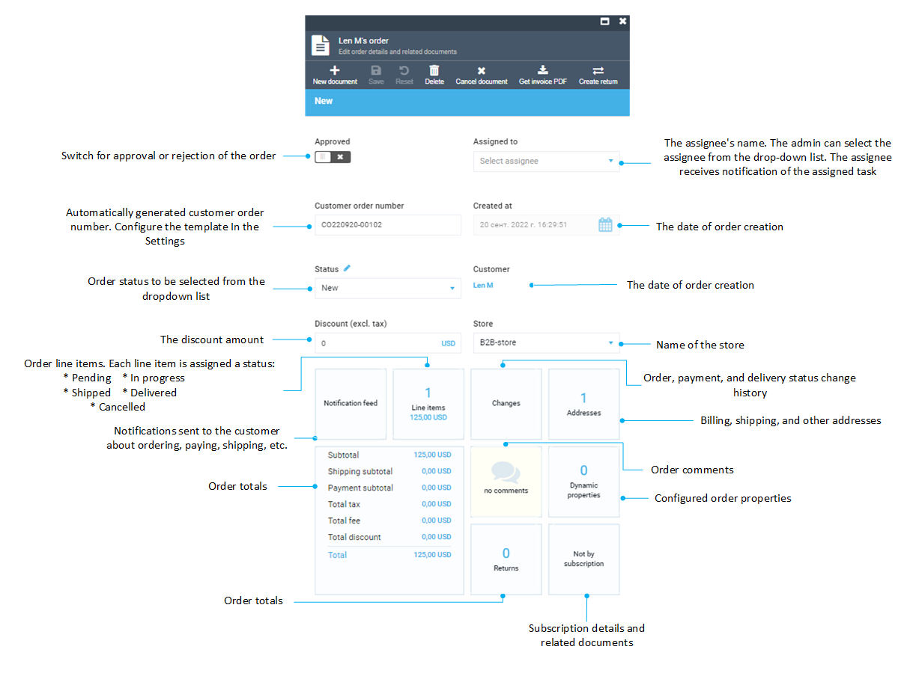
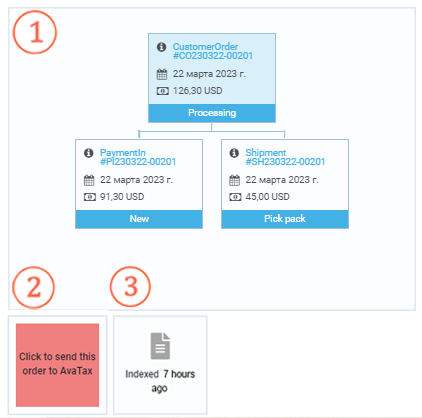

Once the order is created by customer, the details are immediately displayed on the Virto Commerce platform in the **Orders** section.

## General Order Information

| Item | Description                                                                                    |
|------|------------------------------------------------------------------------------------------------|
| 1    | Switch for approval or rejection of the order.                                                 |
| 2    | The assignee's name. The admin can select the assignee from the drop-down list. The assignee receives notification of the assigned task.               |
| 3    | Automatically generated customer order number. Use [Settings](settings.md) to configure the template. |
| 4    | The date of order creation.                                                                    |
| 5    | Order status to be selected from the dropdown list.                                           |
| 6    | Customer's name.                                                                               |
| 7    | The discount amount.                                                                           |
| 8    | Name of the store.                                                                             |
| 9    | Notifications sent to the customer about ordering, paying, shipping, etc. For more information, see [Notifications](notifications.md).                      |
| 10   | Order line items. Each line is assigned a status: <ul><li>Pending</li><li>In progress</li><li>Pending</li><li>Shipped</li><li>Delivered</li><li>Cancelled</li></ul>                                                                             |
| 11   | Order, payment, and delivery status change history.                                            |
| 12   | Billing, shipping, and other addresses.                                                         |
| 13   | Order totals.                                                                                  |
| 14   | Order comments.                                                                                |
| 15   | Configured order properties.                                                                   |
| 16   | Return list. For more information, see [Order Processing Scenarios](order-processing-scenarios-overview.md).                                                                                   |
| 17   | Subscription details and related documents.                                                    |

## Shipment, Payment, AvaTax Information

| Item 	| Description                                                                                                                                                                                                                                                                                                   	|
|------	|---------------------------------------------------------------------------------------------------------------------------------------------------------------------------------------------------------------------------------------------------------------------------------------------------------------	|
| 1    	| Shipment, payment, and refund documents. For more information, see [Order Processing Scenarios](order-processing-scenarios-overview.md). |
| 2    	| AvaTax details. The button indicates the last time the order information was sent to AvaTax or the option to send data to AvaTax.  For more information about sending orders information to AvaTax manually, see [Order Processing Scenarios](order-processing-scenarios-overview.md).  For more information about automatic tax calculation, see [AvaTax module](../integrations/avalara/taxes-calculation.md). 	|
| 3    	| Last indexation date. For more information, see [Order Processing Scenarios](order-processing-scenarios-overview.md). |

