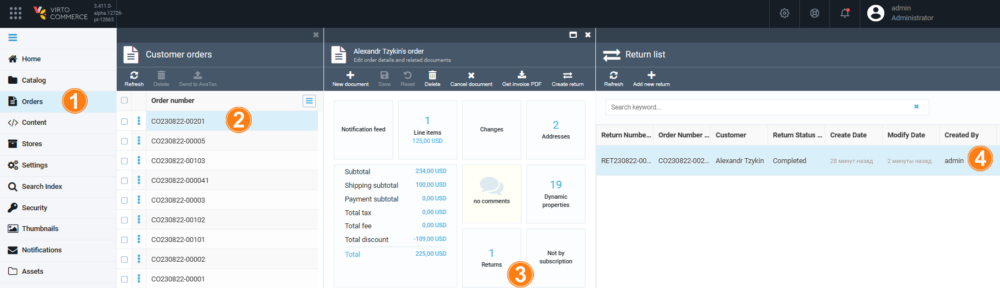

# Managing returns

Managing returns includes:

* [Creating returns](managing-returns.md#create-return)
* [Processing returns](managing-returns.md#process-return)

# Create return

To create a return for a particular order:

1. Select the order and click **Create return**.
1. In the new blade, check the items that require a return. Enter the return reason, if necessary.
1. Click **Make return**.

    

1. The return specifications opens in a new blade.

    

# Process return

To process the received returns:

1. Select the required order and click **Returns**.

    

1. A list of returns appears in the new blade. Click the required return.

    

1. In the new blade, change the return status, enter your resolution, click **Save**.

    
