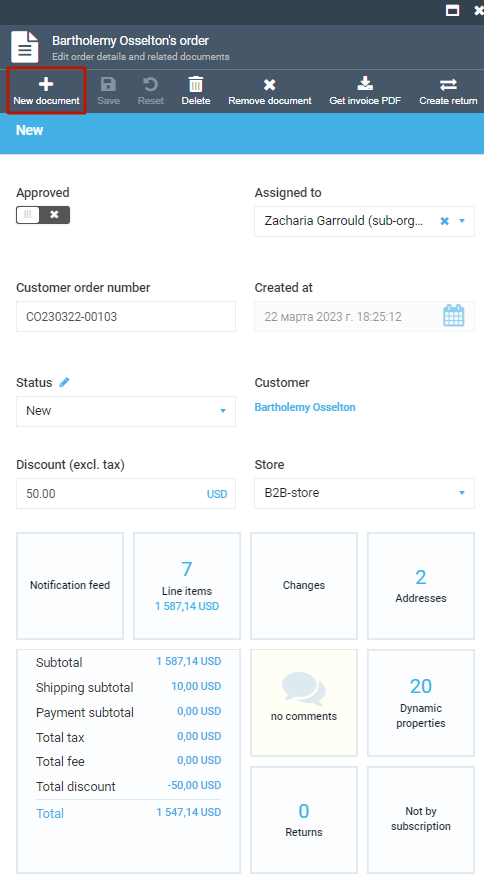
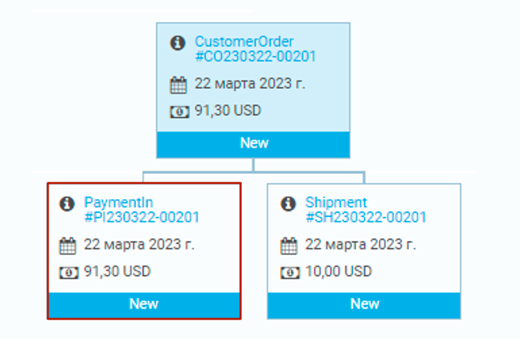

# Creating a New Payment Document

To create a new payment document:

1. Select the required order and click **New document**.

    

1. In the new blade, click **PaymentIn**.

    

1. Fill in the fields of the new payment document. Don't forget to switch the **Approved** option to on.

    

    !!! note
        * Select the required value in the **Status** and **Vendor** fields from a drop-down list or add a new value by clicking .    

    1. To view, edit, or add a payment address, click **Payment address**. 

        

    1. Fill in the fields in the **Manage billing address** blade and click **OK**.

        

    1. To view the list of all payment gateway interactions, click **Transactions**.

        

1. Click **OK** to save changes.

1. To see all the payment documents for the selected order, scroll down to shipment and payment documents section and click **PaymentIn**.

    