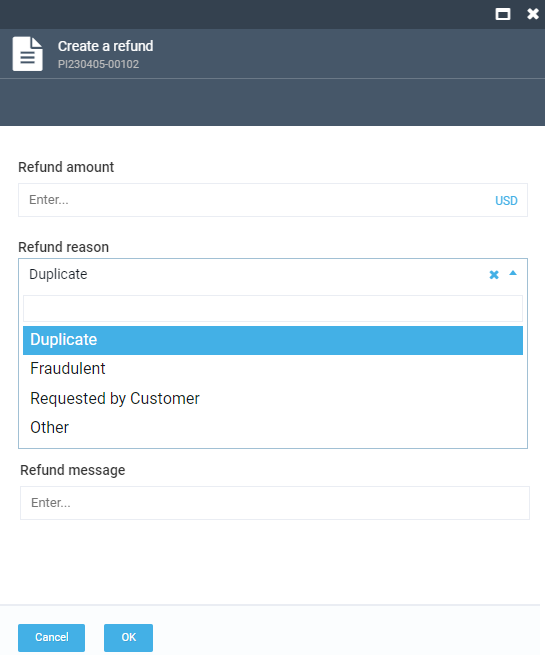

# Creating a New Refund Document

To create a new refund document:

1. Select the required order, scroll down to shipment and payment documents section, and click **PaymentIn**.
    

1. If the payment status is **Paid**, click **Refund payment**.
    

1. In the new blade, enter the refund amount, the refund message, and select the refund reason from a drop-down list. Click **OK** to save the changes.

    

1. The new refund document appears in the shipment and payment documents section.
    

1. Click it to see the details.
    
