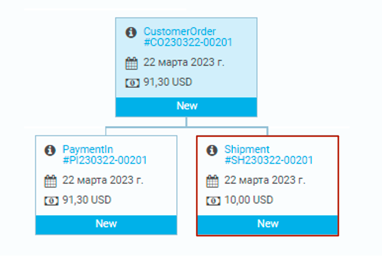

# Creating a New Shipment Document

To create a new shipment document:

1. Select the required order and click **New document**.

    

1. In the new blade, click **Shipment**.

    

1. Fill in the fields of the new shipment document. Don't forget to switch the **Approved** option to on.

    

    !!! note
        * Select the required value in the **Fullfillment center**, **Status**, and **Vendor** fields from a drop-down list or add a new value by clicking .
    
    1. To see, add, or remove shipment items, click **Shipment items**, make changes, and click **OK**.

        
    
    1. To see, add, or delete delivery address, click **Delivery address**, fill in the fields, and click **OK**.

    

1. Click **OK** to save changes.

1. To see all the shipment documents for the selected order, scroll down to shipment and payment documents section and click **Shipment**.

    