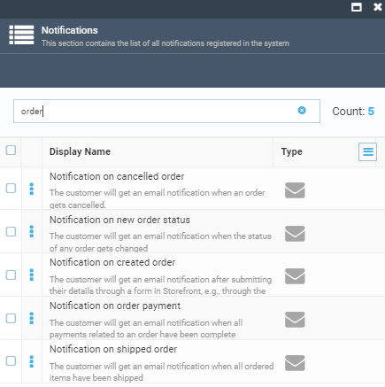

All existing order-specific notifications are:

To view the list of the particular order notifications:

1. Select the required order and click **Notification feed**.

    

1. The list of current notifications appears in the new blade.

    

1. To see the details, click any notification.

    

For more information, see [Notifications](../notifications/overview.md).

To create new notifications, follow the instructions in the [Notification Template](../notifications/notification-templates.md) section.

To enable/disable particular notifications, follow the instructions in the  [Notification List](../notifications/notification-list.md) section.