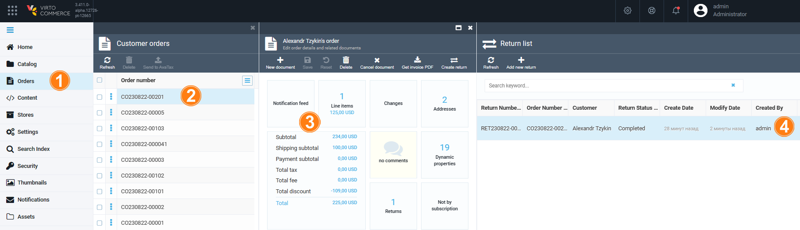
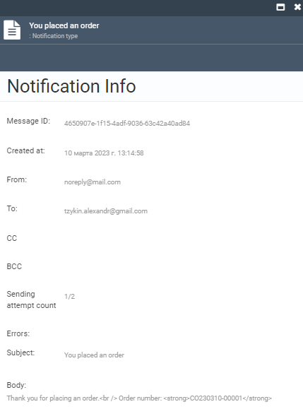
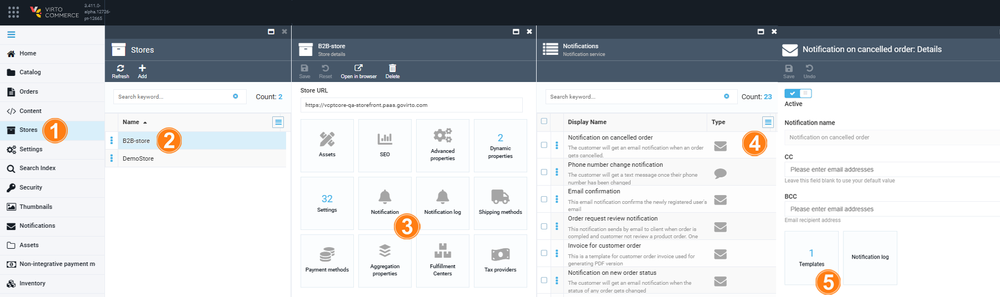
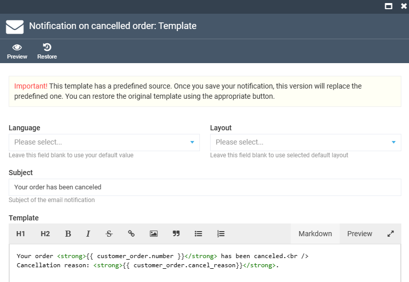
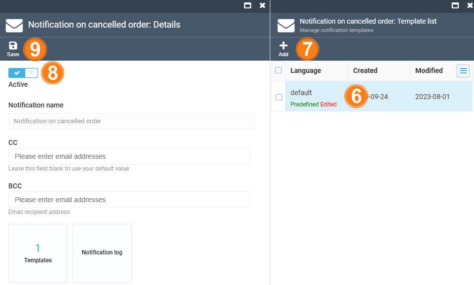

The customer is notified of any changes from the time the order is placed to the time the order is shipped:

| Processing step 	| Notification                             	| Description                                                                                                                                         |
|-----------------	|----------------------------------------	|-------------------------------------------------------------------------------------------------------------------------------------------	|
| Order           	| <ul> <li>Notification on created order</li>  <li>Notification on new order status</li> <li>Notification on cancelled order</li> </ul> 	| <ul> <li>The customer gets an email notification after submitting their details through a form in the Storefront.</li><li>The customer gets an email notification when the status of any order gets changed.</li> <li>The customer gets an email notification when an order gets cancelled.</li> </ul> 	|
| Payment         	| Notification on order payment           	| The customer gets an email notification when all payments related to an order have been completed.                                   	|
| Shipment        	| Notification on shipped order             | The customer gets an email notification when all ordered items have been shipped.                                                    	|

The users can:

* [View order notifications.](notifications.md#view-order-notifications)
* [Assign Store order notifications.](notifications.md#store-specific-notifications)
* [Create new notifications.](../notifications/notification-templates.md)
* [Enable/ disable notifications.](../notifications/notification-list.md#enablingdisabling-notifications)

## View order notifications

To view the list of the particular order notifications:

1. In the main menu, click **Orders**.
1. In the next **Customer orders** blade, select the required order.
1. In the **Edit order details and related documents** blade, click on the **Notification feed** widget. 

    

1. The list of current notifications appears in the new blade.

    

1. To see the details, click any notification.

    

For more information, see [Notifications](../notifications/overview.md).

## Assign store specific notifications

To assign store specific notifications: 

1. In the main menu, click **Stores**.
1. Select the required store in the **Stores** blade.
1. Click on the **Notification** widget.
1. In the **Notifications** blade, select the required notification.
1. In the next blade, click the **Templates** widget to see the list of templates. 

    

1. Click **default** to use or edit the default notification template.
1. Click **Add** in the toolbar to create a new template. 

    ??? Example
        {: width="600"}

1. Make sure the **Active** switch is on in the notification details blade.
1. Click **Save** in the toolbar to save the changes.

    {: width="550"}

Your notification has been added to the list.