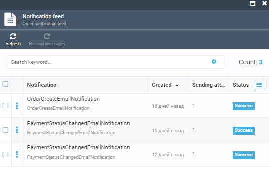

The customer is notified of any changes from the time the order is placed to the time the order is shipped:

| Processing step 	| Notification                                                                                                                         	| Description                                                                                                                                                                                                                                                                                                     	|
|-----------------	|--------------------------------------------------------------------------------------------------------------------------------------	|-----------------------------------------------------------------------------------------------------------------------------------------------------------------------------------------------------------------------------------------------------------------------------------------------------------------	|
| Order           	| <ul> <li>Notification on created order</li>  <li>Notification on new order status</li> <li>Notification on cancelled order</li> </ul> 	| <ul> <li>The customer will get an email notification after submitting their details through a form in Storefront.</li> <li>The customer will get an email notification when the status of any order gets changed.</li> <li>The customer will get an email notification when an order gets cancelled.</li> </ul> 	|
| Payment         	| Notification on order payment                                                                                                        	| The customer will get an email notification when all payments related to an order have been completed.                                                                                                                                                                                                          	|
| Shipment        	| Notification on shipped order                                                                                                        	| The customer will get an email notification when all ordered items have been shipped.                                                                                                                                                                                                                           	|

## Viewing Order Notifications

To view the list of the particular order notifications:

1. Select the required order and click **Notification feed**.

    

1. The list of current notifications appears in the new blade.

    

1. To see the details, click any notification.

    

For more information, see [Notifications](../notifications/overview.md).

## Store Specific Notifications

To assign store specific notifications: 

1. Select the required store in the **Stores** module.

1. Click **Notification** and select the required one in the new blade.

1. In the new blade, click **Templates** to see the list of templates. 

    * Use or edit the default notification template.

    

    * Create a new template. 

    

1. Make sure the **Active** switch is on.

    

To create new notifications, follow the instructions in the [Notification Template](../notifications/notification-templates.md) section.

To enable/disable particular notifications, follow the instructions in the  [Notification List](../notifications/notification-list.md) section.