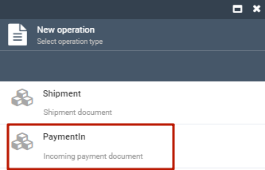
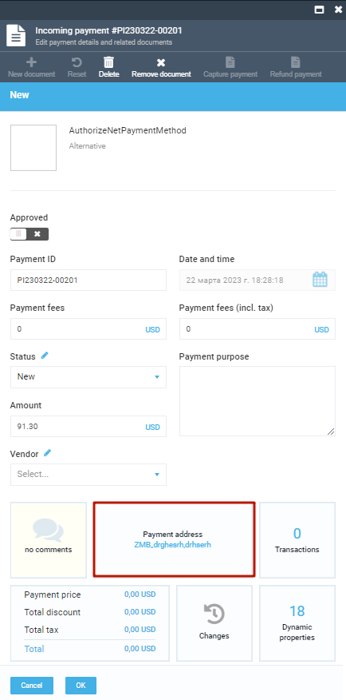
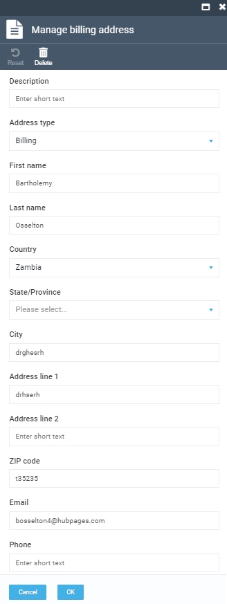
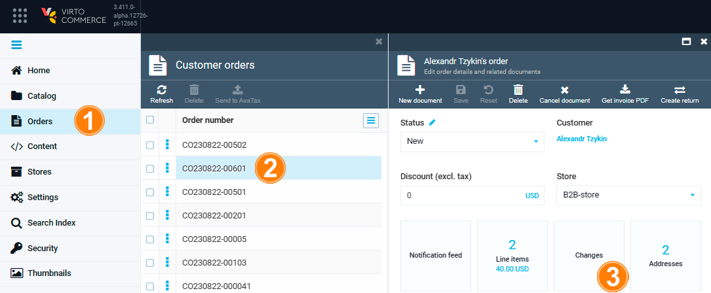

# Basic order processing scenarios

Order processing includes the steps involved in fulfilling a customer's order: receiving and reviewing the order, verifying payment and stock availability, picking and packing the items, shipping the order, and updating the customer on the order status. Below are the basic order processing scenarios.

## Getting invoice PDF

To get an invoice in PDF format:

1. Go to **Orders**.
2. Select the requried invoice.
3. Click **Get invoics PDF**. 

The invoice PDF opens in a new window.

## Creating a New Shipment Document

To create a new shipment document:

1. Select the required order and click **New document**.

    

1. In the new blade, click **Shipment**.

    

1. Fill in the fields of the new shipment document. Don't forget to switch the **Approved** option to on.

    

    !!! note
        * Select the required value in the **Fullfillment center**, **Status**, and **Vendor** fields from a drop-down list or add a new value by clicking .
    
    1. To see, add, or remove shipment items, click **Shipment items**, make changes, and click **OK**.

        
    
    1. To see, add, or delete delivery address, click **Delivery address**, fill in the fields, and click **OK**.

    

1. Click **OK** to save changes.

1. To see all the shipment documents for the selected order, scroll down to shipment and payment documents section and click **Shipment**.

    

## Creating a New Payment Document

To create a new payment document:

1. Select the required order and click **New document**.

    

1. In the new blade, click **PaymentIn**.

    

1. Fill in the fields of the new payment document. Don't forget to switch the **Approved** option to on.

    

    !!! note
        * Select the required value in the **Status** and **Vendor** fields from a drop-down list or add a new value by clicking .    

    1. To view, edit, or add a payment address, click **Payment address**. 

        

    1. Fill in the fields in the **Manage billing address** blade and click **OK**.

        

    1. To view the list of all payment gateway interactions, click **Transactions**.

        

1. Click **OK** to save changes.

1. To see all the payment documents for the selected order, scroll down to shipment and payment documents section and click **PaymentIn**.

    

## Tracking Order Changes

To view the order changes history, including payment, shipment, and other modifications:

1. Select the required order and click **Changes**.

    

1. Information about order placement, payment, shipment, etc. appears in the new blade. Select additional information fields from the drop-down list in the upper right corner.

    

## Creating Returns

To create a return for a particular order:

1. Select the order and click **Create return**.
1. In the new blade, check the items that require a return. Enter the return reason, if necessary.
1. Click **Make return**.

1. The return specifications opens in a new blade.

## Processing Returns

To process the received returns:

1. Select the required order and click **Returns**.

    

1. A list of returns appears in the new blade. Click the required return.

    

1. In the new blade, change the return status, enter your resolution, click **Save**.

    

## Sending Order Information to AvaTax

To send the order information to AvaTax manually:

1. Click the button:

    

1. In the new blade, click **Send to AvaTax**. 

    

1. Check the updated information on the button:

    

To set automatic tax calculation, see [AvaTax module](../integrations/avalara/taxes-calculation.md). 

## Indexation

To start indexation:

1. Click the button with the last indexation date:

    

1. In the new blade, click **Build index**.

    

1. The notification of successful indexation appears.

    
