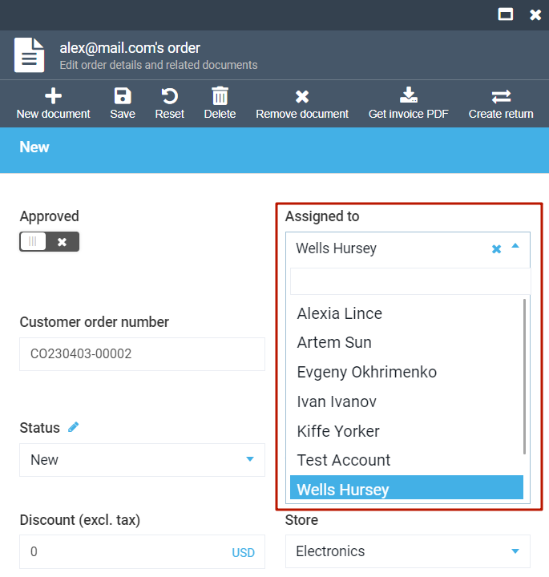

To maintain data security and privacy, specify what actions, such as reading, writing, deleting, or modifying data, a user can perform.

The pre-defined order-related permissions are:

| Permission                   	| Descrpiption               	|
|------------------------	|----------------------------	|
| order:read             	| View order related data.   	|
| order:create           	| Create order related data. 	|
| order:update           	| Update order related data. 	|
| order:access           	| Access order related data. 	|
| order:delete           	| Delete order related data  	|
| order:read_prices      	| View order prices.         	|
| order:update_shipments 	| Update shipments.          	|
| order:capture_payment  	| Capture payment.           	|
| order:refund           	| Refund order.              	|

## Order Assignees

To assign order procession to specific users: 

1. Select the required order in the **Orders** module.

1. In the **Assigned to** field, select the assignee from a drop-down list.

Now only the assigned user can process the order.

To create a new role and assign permissions to a user, follow the instructions in the [Creating New Role](https://docs.virtocommerce.org/new/user_docs/security/roles-and-permissions/#creating-new-role) section. 

To edit roles and permissions, follow the instructions in the [Editing Roles](https://docs.virtocommerce.org/new/user_docs/security/roles-and-permissions/#editing-roles) section.