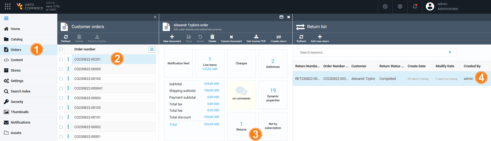

# Processing Returns

To process the received returns:

1. Select the required order and click **Returns**.

    

1. A list of returns appears in the new blade. Click the required return.

    

1. In the new blade, change the return status, enter your resolution, click **Save**.

    
