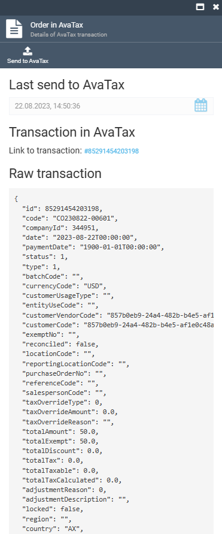

# Sending Order Information to AvaTax

To send the order information to AvaTax manually:

1. Click the button:

    

1. In the new blade, click **Send to AvaTax**. 

    

1. Check the updated information on the button:

    

To set automatic tax calculation, see [AvaTax module](../integrations/avalara/taxes-calculation.md). 
