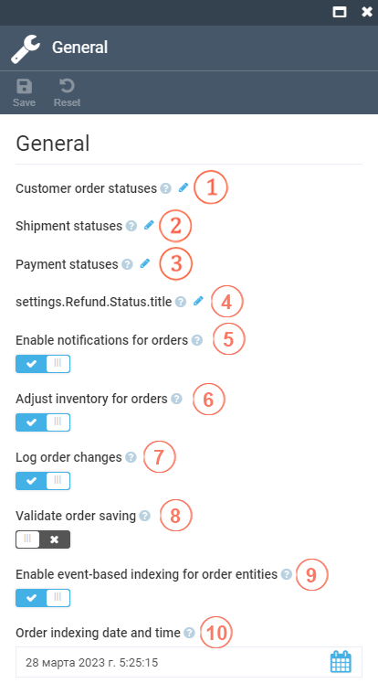
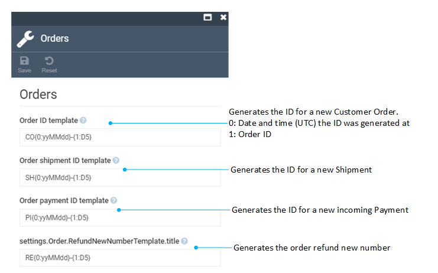

# Settings

This section covers the Order module settings.

## General Settings

To find general order settings, go to Settings > Order > General. 

| Item 	| Description                                                                                                                                                                         	|
|------	|-------------------------------------------------------------------------------------------------------------------------------------------------------------------------------------	|
| 1    	| Selects the available status (**New**, **Pending**, **Processing**, **Completed**, **Cancelled**) or adds a new one.                                                                  	|
| 2    	| Selects the available status (**New**, **Ready to send**, **PickPack**, **Send**, **Cancelled**) or adds a new one.                                                                   	|
| 3    	| Selects the available incoming status (**New**, **Pending**, **Authorized**, **Custom**, **Paid**, **PartiallyRefunded**, **Refunded**, **Voided**, **Cancelled**) or adds a new one. 	|
| 4    	| Selects the available refund status (**New**, **Pending**, **Paid**, **PartiallyRefunded**, **Refunded**, **Authorized**, **Custom**, **Voided**, **Cancelled**) or adds a new one.   	|
| 5    	| Sends a notification when the order status changes when switched to on.                                                                                                             	|
| 6    	| Adjusts the inventory when the order status changes when switched to on.                                                                                                            	|
| 7    	| Logs order changes into the platform operation log when switched to on.                                                                                                             	|
| 8    	| Enables validation of saving an order when switched to on.                                                                                                                          	|
| 9    	| Any changes to the customer entity will trigger a background task that will apply these changes to the search index when swicthed to on.                                            	|
| 10   	| Date and time of the latest order indexing task.                                                                                                                                    	|

## Order Templates

To find order templates, go to Settings > Order > Orders.

| Item 	| Description                                                                                                                                                                 	|
|------	|-----------------------------------------------------------------------------------------------------------------------------------------------------------------------------	|
| 1    	| This template will be used to generate the ID for a new Customer Order.   `CO{0:yyMMdd}-{1:D5}`  0: Date and time (UTC) the ID was generated at  1: Order ID       	|
| 2    	| This template will be used to generate the ID for a new Shipment.  `{0:yyMMdd}-{1:D5}`  0: Date and time (UTC) the ID was generated at  1: Order ID                	|
| 3    	| This template will be used to generate the ID for a new incoming Payment.  `PI{0:yyMMdd}-{1:D5}`  0: Date and time (UTC) the ID was generated at  1: Order ID       	|
| 4    	| This template will be used to generate the order refund new number.  `RE{0:yyMMdd}-{1:D5}`  0: Date and time (UTC) the order refund was generated at  1: Order ID  	|