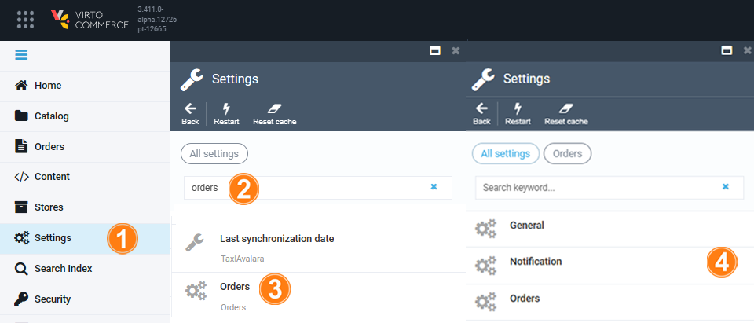
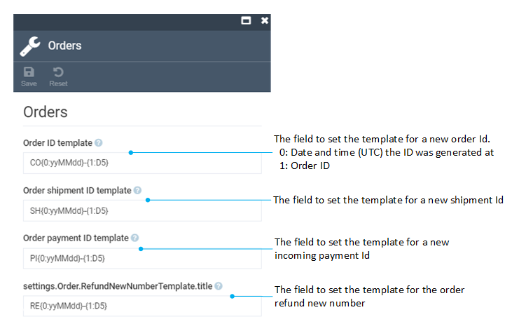

# Settings

To manage the settings:

1. Click **Settings** in the main menu.
1. In the next blade, type **Orders** to find the settings related to the module.
1. Select **Orders**.
1. Select:
    * [General settings](settings.md#general-settings)
    * [Search settings](settings.md#notification-settings)
    * [Orders templates settings](settings.md#orders-templates-settings)

{: width="700"}

## General settings

In the general settings blade, you can configure order, shipment, and payment statuses, enable order changes logging or event-based indexing and more. 

## Notification settings

In the **Notification** blade, you can configure notifications sent to the users.

## Orders templates settings

In the **Orders** blade, you can configure templates for order, shipment, payment, and refund Ids. 

