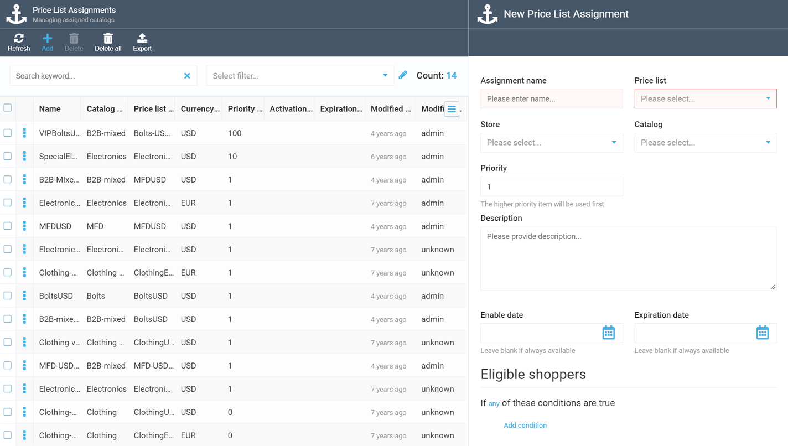
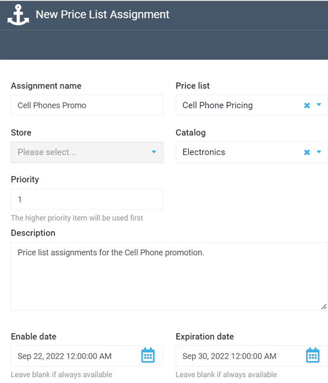

# Adding New Price List Assignment

Price list assignments associate specific price lists with the approrpiate catalogs and stores, i.e. they do all the linking job, so that the prices may be asdsigned to the correct items. Apart from that, with a price list assignment, you can target specific custmers eligible for the prices in question.

To add a new price list assignment, navigate to the ***Pricing*** module and select ***Price List Assignments*** to open the ***Price List Assignments*** screen:

Give your new assignment a name and a description, select the appropriate price list, specify the relevant store or catalog, and provide priority, enable date, and expiration date:

!!! warning
	For a price list assignment, you can either specify a store or a catalog, but not both.

!!! note
	Adding a start and end date for your price list assignment is optional and may come in handy when you create a special price list for a promotion with a certain validity period. If you leave the date fields blank, your price list assignment will be valid until you delete it or change dates.
	
## Customer Targeting

The targeting feature allows you to tailor your price list assignment (and, eventually, the price list in question) to only specific customer categories.

The targeting feature in the Pricing module works pretty much in the same way as in the Marketing module. You can read about it in the [Publish Conditions guide](../marketing/publish-conditions.md).

