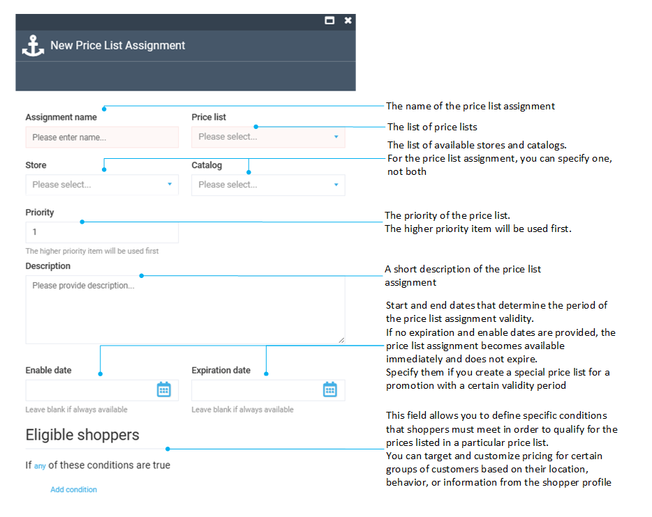

# Manage price list assignments

Price list assignments associate specific price lists with the appropriate catalogs and stores, i.e. they handle all the necessary linking, ensuring that prices are accurately assigned to the respective items. You can also use a price list assignment to target specific customers who are eligible for the relevant prices.

## Add price list assignment

To add a new price list assignment:

1. Click **Pricing** in the main menu.
1. In the next blade, select **Price List Assignments**.
1. In the next blade, click **Add** in the toolbar to open the **New Price List Assignment** blade.
1. Fill in the following fields.

	

!!! note

	The targeting feature in the Pricing module functions quite similarly to that in the Marketing module.
	
	Read more about it in the [Publish conditions guide](../marketing/publish-conditions.md).

