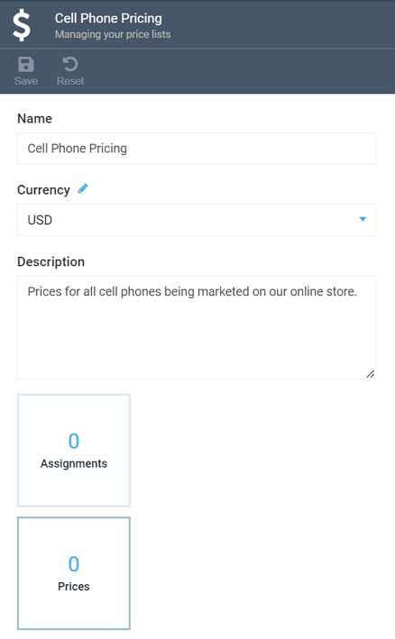
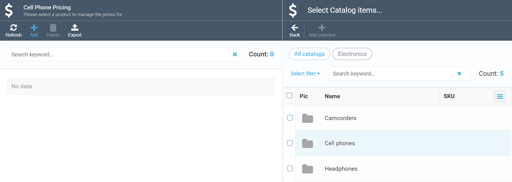
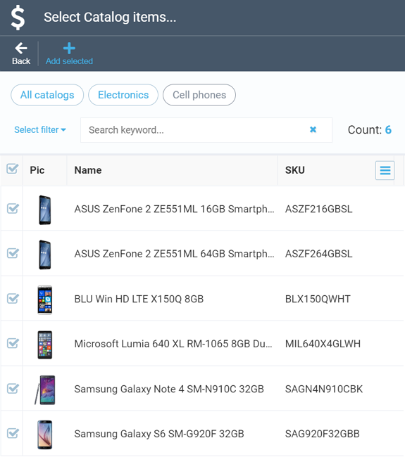
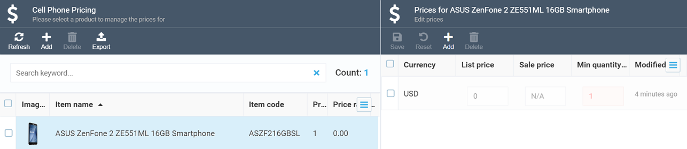
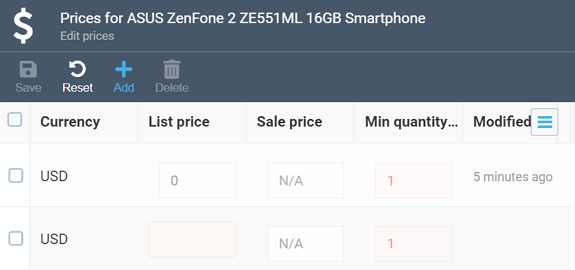

# Add products to price List

Once you have [created a new price list](creating-new-price-list.md), you will need to add some prices to it.

In order to add prices, select your new price list to open it and click the ***Prices*** widget:

This will open another screen, where you will need to click ***Add*** and, in yet anopther screen, select the category you want to add the product prices from:

After you click the category in question, the **Select catalog items** screen will show up. Here, you may either check specific products you need, individually, or tick the top checkbox to select all products; either way, you will need to hit ***Add selected*** to add the prices of the selected products to your price list:

## Add and edit product prices

Some products of yours may either not yet have assigned prices when you add them to your price list, or lack the specific price you currently need. In this case, you can both edit the existing prices and add new ones right from the Pricing module.

To start editing or adding a price, click the product in question in your price list to open the dedicated screen for adding and editing prices:

Click the existing price or add a new one by clicking the appropriate button and then start editing it:

As you can see from the image above, the editable fields are ***List price***, ***Sale price***, and ***Minimum quantity*** (which, by default, cannot be less than 1).

Once you are done editing, click **Save** to save your changes.

