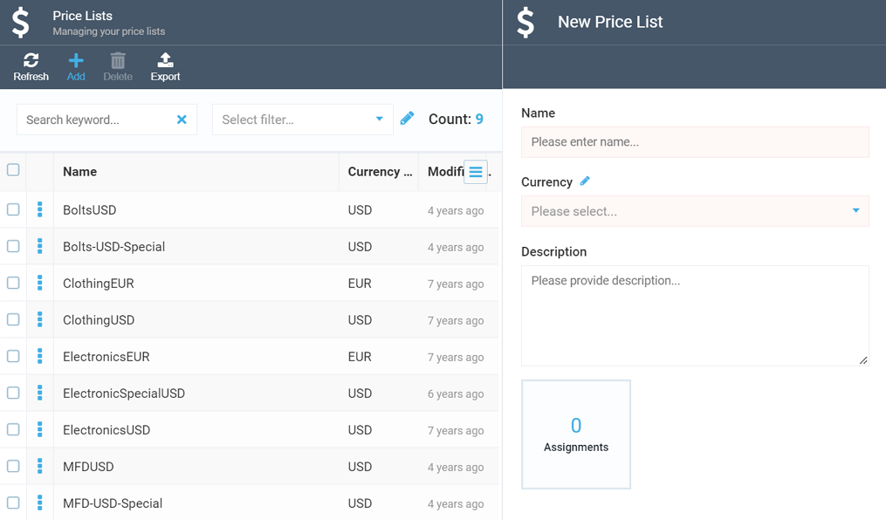
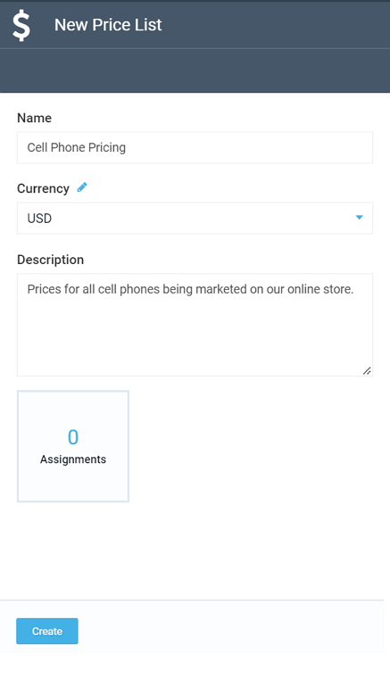

# Creating New Price List

Price lists act as containers for various product prices. They may come in handy when you want to store prices for items, say, of a specific category in a single place.

To create a new price list, navigate to the ***Pricing*** module and do the following

+ Click the **Add** button on the top toolbar, above the existing price lists (if there are any). This will open the ***New Price List*** screen:

+ Give your new price list a new and a description, and hit ***Create***:

Your new price list will appear in the list.

!!! tip
	You can also add price list assignments to your price lists. Read more about price lists assignments [here](adding-new-assignment.md).
