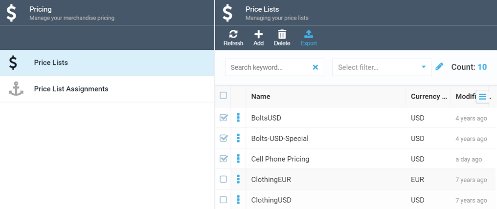
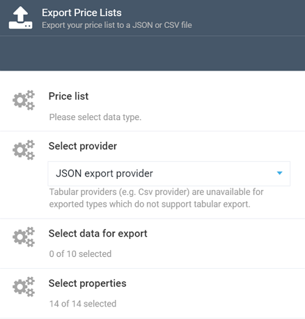

# Export Feature

Virto's Pricing module provides the Export feature out-of-the-box, which allows you to export various data, including prices, price lists, and price list assignments.

## Exporting Pricing Data

To start exporting your pricing data, navigate to the Pricing module, select either ***Price Lists*** or ***Price List Assignments***, depending on what you are going to export, select the relevant data by ticking the appropriate checkboxes, and hit ***Export***:

!!! tip
	You can tick the top checkbox to select all data.

Once you have clicked the ***Export*** button, a dedicated screen will show up:

Check whether the data type is correct, select export provider (either CSV or JSON), select more data or properties, if required, and click ***Start***.

<!---add note and link to the Export module--->