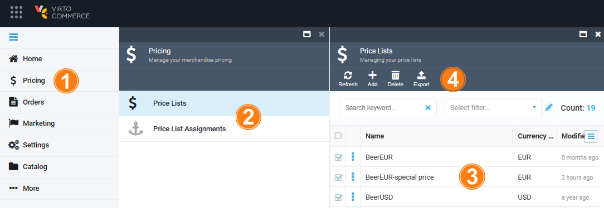
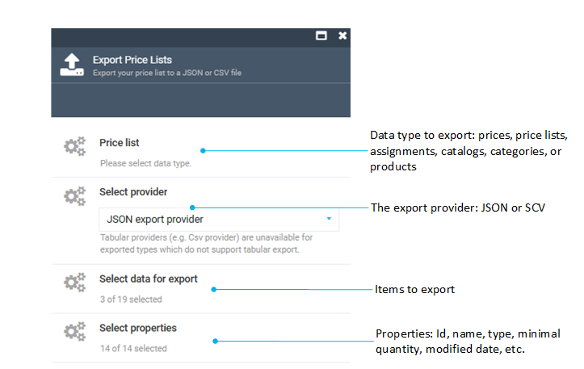

# Pricing data export

Virto's Pricing module provides the Export feature out-of-the-box, enabling you to export various data, including prices, price lists, and price list assignments.

To start exporting your pricing data:

1. Click **Pricing** in the main menu. 
1. In the next blade, click **Price Lists** or **Price List Assignments** depending on what you are going to export.
1. Check the relevant data.
1. Click **Export**.

	

1. Fill in the following fields:

	

1. Click **Start**.

<!---add note and link to the Export module--->