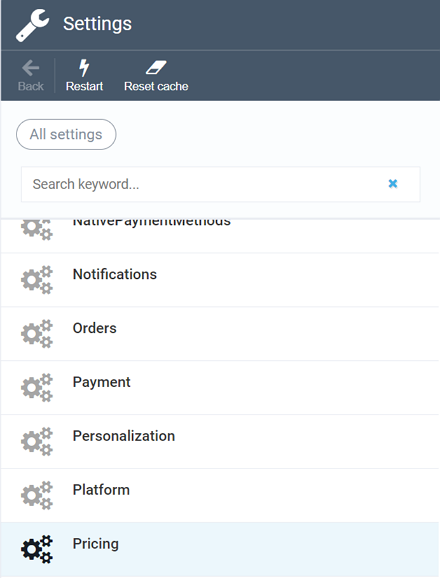
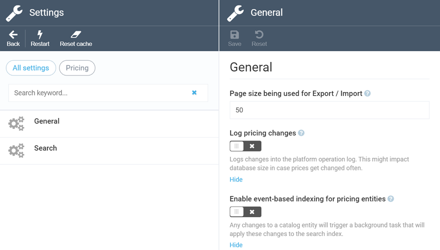
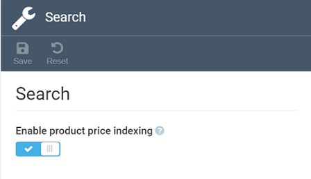

# Pricing Module Settings

In order to access Pricing settings, navigate to ***Settings*** and select ***Pricing***:

The ***Settings*** screen has two options, ***General*** and ***Search***. Use general settings to configure the page size for export and import and enable or disable logging pricing changes and event-based indexing:

The ***Search*** settings have only one option that allows you to enable or disable price indexing:

