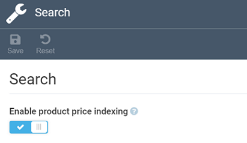

# Settings

The Price module settings include:

* [General settings](managing-pricing-module-settings.md#general-settings)
* [Search settings](managing-pricing-module-settings.md#search-settings)

## General settings

To configure general settings:

1. Click **Settings**.

1. Type **Pricing** to find the settings related to the module.

1. Select **General** to :
    * Configure the page size for export or import.
    * Enable/ disable logging of pricing changes.
    * Enable/ disable and event-based indexing.

	

1. Click **Save** to save the changes.

## Search settings

To configure search settings: 

1. Click **Settings**.

1. Type **Pricing** to find the settings related to the module.

1. Select **Search** to enable or disable price indexing.

	

1. Click **Save** to save the changes.