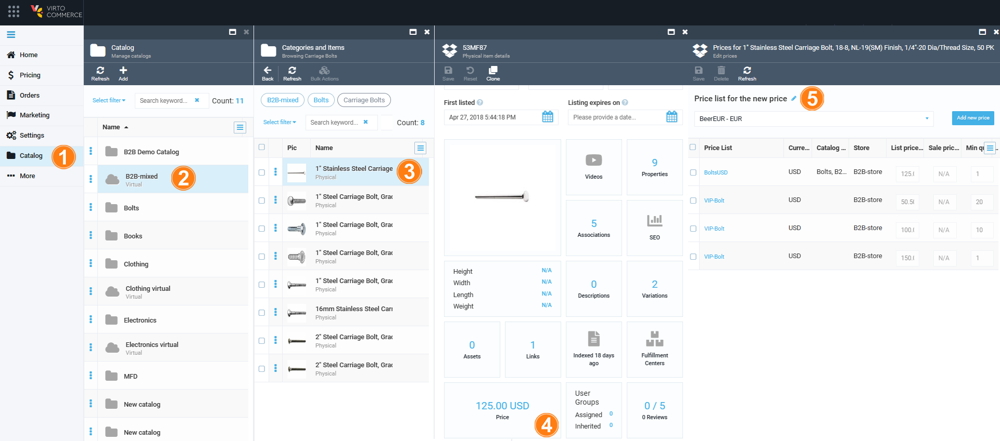

# Viewing prices in Catalog

In addition to the dedicated Pricing module, you can also manage prices and price lists by navigating to them through the Catalog module. This can be useful if you want to manage prices or price lists for specific categories or products.

To manage prices via Catalog:
 
1. Click **Catalog** in the main menu.
1. Select the required category:
1. Click the item you want to manage the pricing data for. This will open a dedicated screen, where you will need to scroll down to locate the **Price** widget:
1. Click the **Price** widget to view.
1. Modify prices and price list for the product.

    

1. Click **Save** to save the changes.