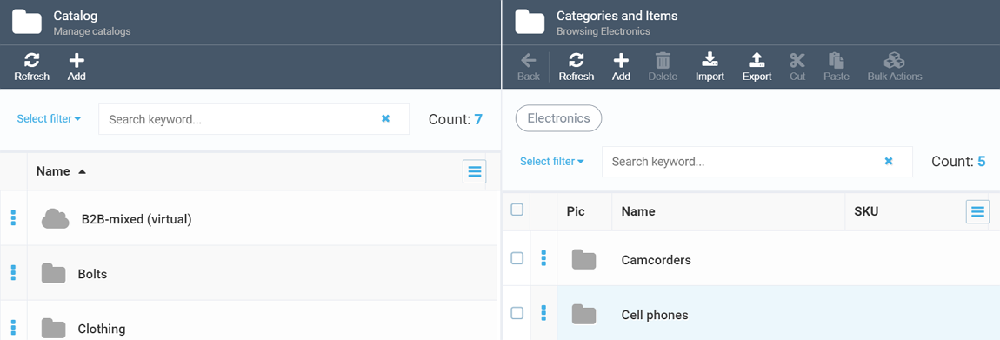
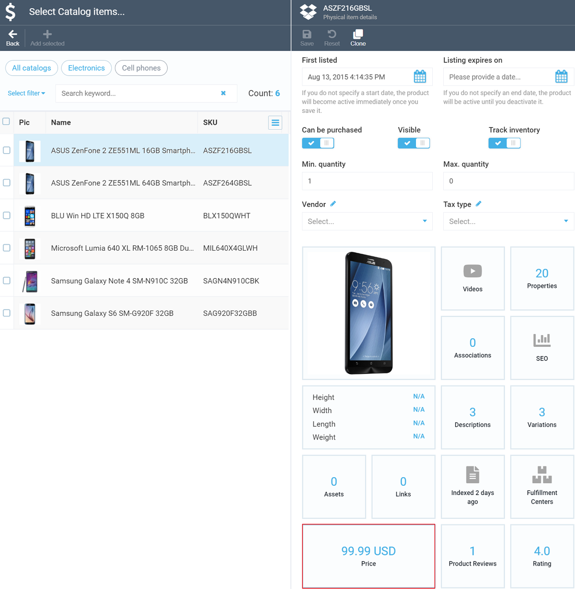
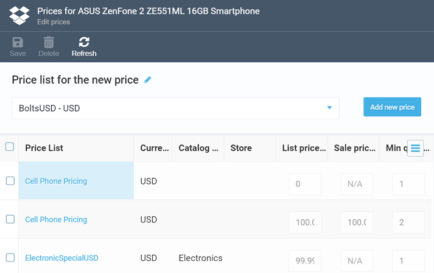

# Viewing Prices in Catalog

Apart from the dedicated Pricing module, you can also manage prices and price lists by navigating to them through the Catalog module. This may come in handy when you want to manage prices or price lists for specific categories or products.

To start managing prices through Catalog, do the following:

+ Navigate to ***Catalog*** and select the appropriate category:

+ Click the item you want to manage the pricing data for. This will open a dedicated screen, where you will need to scroll down to locate the ***Price*** widget:

+ Click the ***Price*** widget to view and start managing prices and price list for the product in question:

