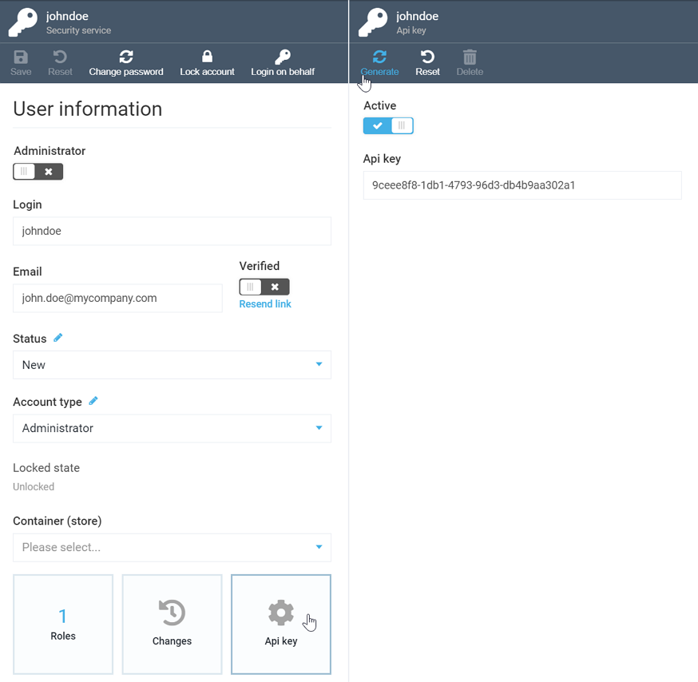

# Generating API Key
Sometimes, for API authentication, you will need to generate an API key for a [user you created](managing-users.md). To do so:

+ Open the user account
+ Select the ***API key*** widget
+ Click the ***Generate*** button in the menu bar
+ Activate the key by toggling the ***Active*** button:

!!! warning
	+ If you de-activate your API key, the system will not allow API calls using the old key.
	+ In case you de-activate and then re-activate your API key, the system will not allow the old key, and a new API key will be generated instead.
