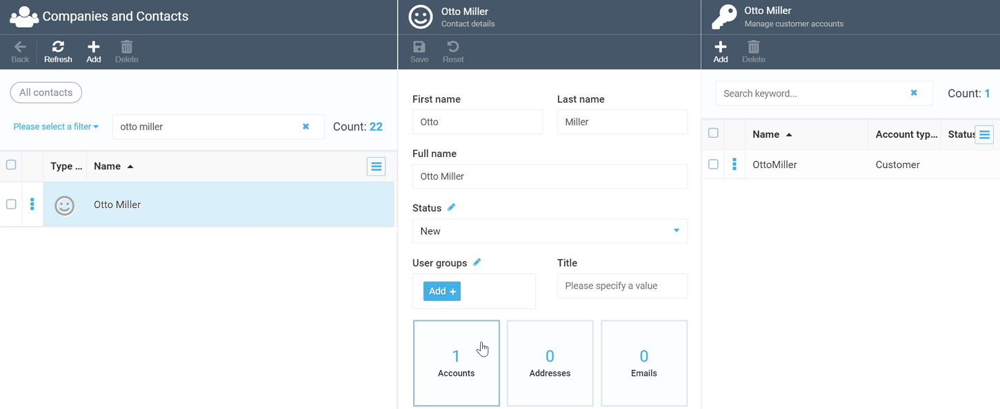
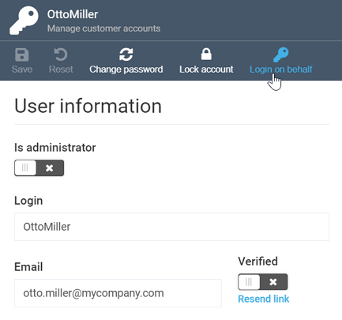
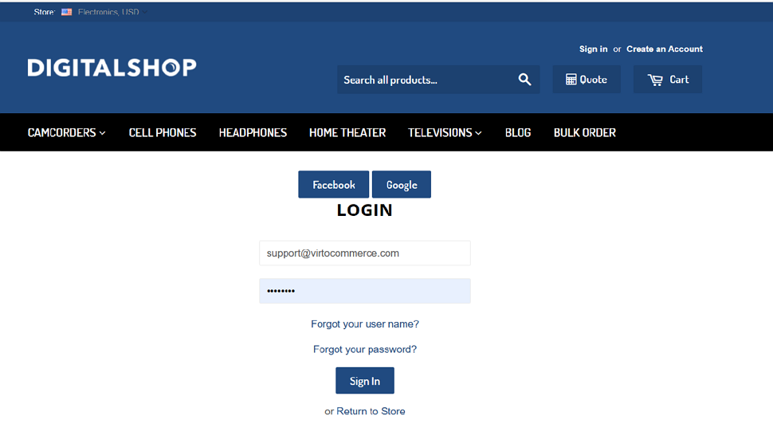
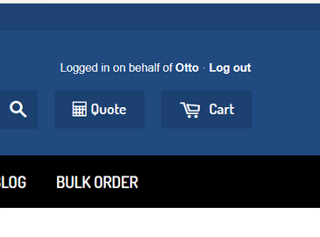

# Login on Behalf Feature
If you are an administrator or a support engineer maintaining a Virto Commerce based web store, you can log in under another user account through our ***Login on Behalf*** feature. You may want to do so to see what a user sees on a webpage, help them place an order, or even make payment on their behalf.

!!! note
	All actions performed through the Login on Behalf feature are strictly logged to avoid possible claims from customers.

## How it works

The ***Login on Behalf*** feature helps you increase the performance of those who work with your web store. It also contributes significantly to customer satisfaction and brand loyalty while decreasing the number of abandoned carts.

When a user reports an issue with an order processing operation or finds a bug, a support engineer often needs to see what that user sees. This is especially important in cases when an application error occurs, since it may be difficult to re-create the error.

Additionally, with ***Login on Behalf***, more experienced people can show the staff how to move around the app. For example, an admin can help a salesperson bulk-add products from an Excel file.

## Step by Step Instructions
To log in on behalf of another user, you should first sign into Virto Commerce portal as an administrator.

!!! note
	After signing in, make sure to check the admin role and the respective permissions have been assigned properly.

Go to the [Companies and Contacts](https://docs.virtocommerce.org/new/user_docs/contacts/overview/) module and find the customer you need to log in on behalf of. On the ***Contact Details*** screen, click the ***Accounts*** widget to open the customer's user account profile:

In the account profile, click the ***Login on behalf*** button:

Virto Commerce will open a new tab with Storefront and prompt you to re-enter your credentials, for security reasons:

That's it. You are now logged in on behalf of your customer:

