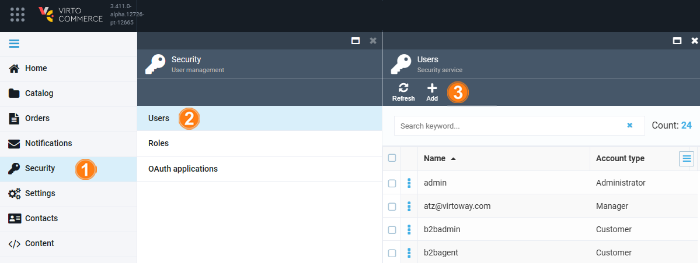

# Managing user accounts

Managing user accounts includes:

* [Creating new users and assigning roles to them](managing-users.md#create-new-user)
* [Editing user accounts](managing-users.md#edit-user-account)

## Create new users and assign roles to them

After installing Virto Commerce Platform, a single user with administrator rights will be automatically created. Following this, you will need to create additional users and assign roles to them based on your company's requirements. Only users with administrator rights possess the permission to manage users and roles.

To create new users and assign roles to them:

1. Click **Security** in the main menu.
1. In the next blade, click **Users** to open the **Users** blade.
1. Click **Add** in the toolbar.

	

1. Fill in the fields. Each user must have at least one role assigned.

	

1. Click **Create** to save the changes.

Your new user has been added to the list in the **Users** blade.

## Edit user account

To edit a user:

1. Follow steps 1-2 from the instruction above.
1. Select the required user and edit the following fields in the next blade. 

	

1. Confirm changes.

[Read more about Login on behalf](login-on-behalf.md){ .md-button }

[Read more about API keys](api-key.md){ .md-button }