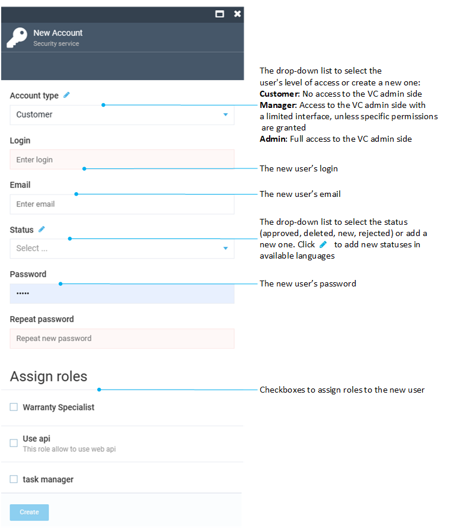
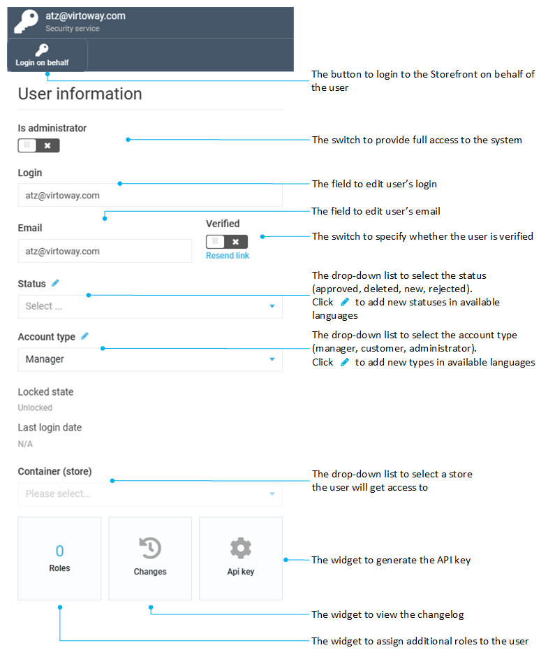

# Managing User Accounts

This guide will explain you how to create and manage user accounts in Virto Commerce.

## Creating New User
Once you install Virto Commerce Platform, it will create a single user with the administrator privileges. You will then need to create more users and assign roles to them as you see fit for your company.

!!! note
	Only administrator users have permission to manage users and roles.

To create a new user, you first need to go to ***More -> Security***. The system will automatically open the ***Users*** screen with a list, which will have only one user in case you just installed the platform. Click the ***Add*** button on the top toolbar to open the ***New Account*** screen:

 

The first part of the screen allows you to specify account type, username (login), email, status, and password:

!!! note
	The account type determines which kind of access the user you are creating will have:
	
	+ *Customer:* The user will not have access to the VC admin side at all.
	+ *Manager:*: The user will be able to login to the VC admin side but will only see blank interface, unless provided with specific permissions.
	+ *Admin:* This account type provides the user with full access to the VC admin side.

The second part of the screen allows you to assign one or more roles to your user:

!!! tip
	You can read more about user roles in [this dedicated guide](roles-and-permissions.md).

!!! note
	Each user must have at least one role assigned.

After providing all details and assigning roles, hit the ***Create*** button. Your new user will appear in the list on the ***Users*** screen.

## Managing User Account
Once you create a new user account, you can select it to provide some additional details and tweak a few more things, such as:

+ Use the ***Administrator*** toggle to provide full access to the system
+ Use the ***Verified*** toggle to specify whether the user is verified
+ Specify the catalog or store the user will have access to
+ Assign additional roles to the user through the ***Roles*** widget
+ View the changelog through the ***Changes*** widget
+ Generate the [API key](api-key.md) through the ***API key*** widget

Once you provided all additional details, hit the ***Save*** button:

!!! note
	The ***Locked state*** field cannot be edited. However, you can lock and unlock user accounts using the respective button on the top toolbar. 
