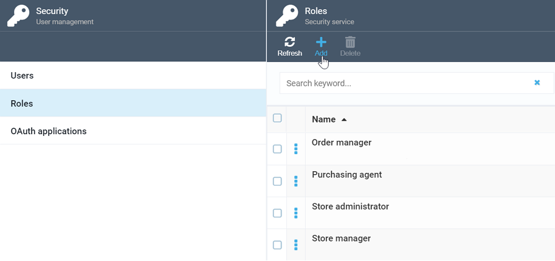
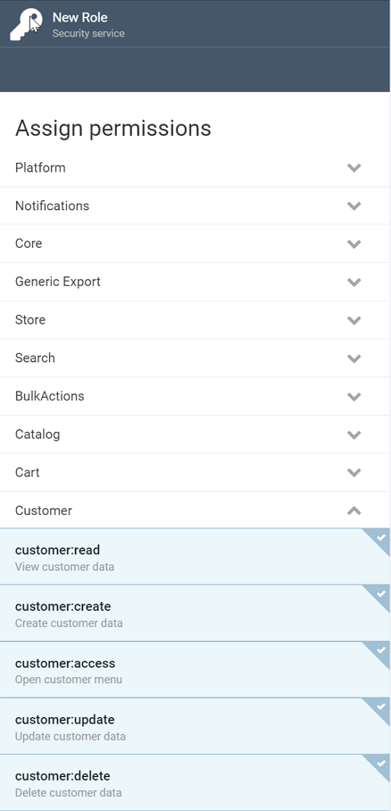

# Roles and Permissions
In Virto Commerce Platform, each user must have at least one role assigned. Virto provides some pre-defined roles out-of-the-box; you can both edit them as you deem fit and create your own ones.

## Creating New Role
To create a new role, go to ***More -> Security*** and select the ***Roles*** option. This will open the ***Roles*** screen, where you need to click the add button:

In the ***New Role*** screen, provide the role name and description and check all applicable permissions. Virto's Security service enables you to assign as granular permissions as possible: for each module and the platform itself, you can select create, read, access, update, delete, and other permissions. In our case, for indicative purposes only, we are creating a role that would allow full access to the Customer module:

## Editing Roles
After you hit ***Create***, your new role will appear in the list on the ***Roles*** screen. Select it to open it for editing at any time and assign or remove additional permissions as you deem fit.
