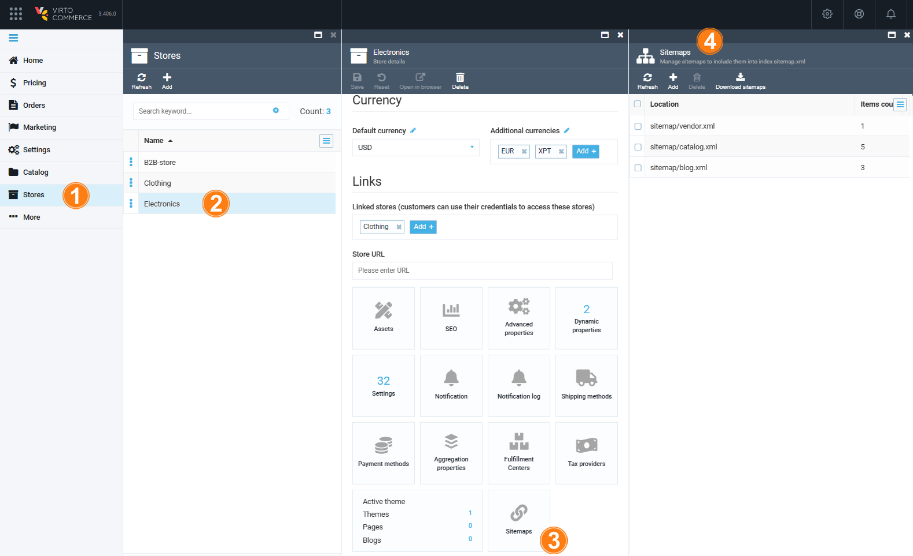

# Configuring Sitemaps
In order to configure the store sitemaps, navigate to  _More > Stores_, select the store you need to manage sitemaps for, and click the  _Sitemaps_  widget. On the  _Sitemaps_  screen, you will see a list of sitemaps to be included into the sitemap index file:

## Adding New Sitemap to Store
In order to add a new sitemap, click the  _Add sitemap_  toolbar button. The  _New sitemap_  screen will show up. Each sitemap contains two required parameters:  _Sitemap location_  and  _Sitemap item location_, as well as a list of items to be included into the sitemap file:

The _Sitemap location_ parameter means where the sitemap file will physically be. The requirements to this parameter are the same as to the respective URL. The sitemap location value must end with the  `.xml`  extension. You cannot use  `sitemap.xml`  as a location, as this is the reserved file name for the sitemap index file. Some good examples may include  `products.xml`  or  `sitemap/vendors.xml`.
    
The _Sitemap item location_ is where the sitemap items are going to be placed. Since this parameter is a second part of the sitemap location, the requirements to its value are the same as to the respective URLs. The value of this option can be constructed with patterns (which will be replaced with language code of the relevant SEO info or with the default store language if the sitemap item has no SEO info, i.e., en-US, en-UK, etc.).

### Adding Sitemap Items
Adding sitemap items includes the following steps:

1.  Select a sitemap from the list and click the  _Add items_  button located on the toolbar.
2.  Provide sitemap items of different types:

+ Catalog sitemap items are like products and categories. For each category, a catalog search for subcategories and products will be performed. This means category sitemap items can be called a 'formal sitemap item', as the number of real sitemap items for a category sitemap item can be much more than one. For each category and product, a different URL record for SEO sematic URL will be added to the relevant language.
+ Vendor sitemap items. For each vendor, a different URL record for SEO sematic URL will be added in the relevant language.
+ Custom sitemap items. If you want to include a custom URL in a sitemap, set its absolute URL here.

3.  Select the item and add it to the sitemap.
4.  The selected item will be added to the  _Sitemap_  screen:

