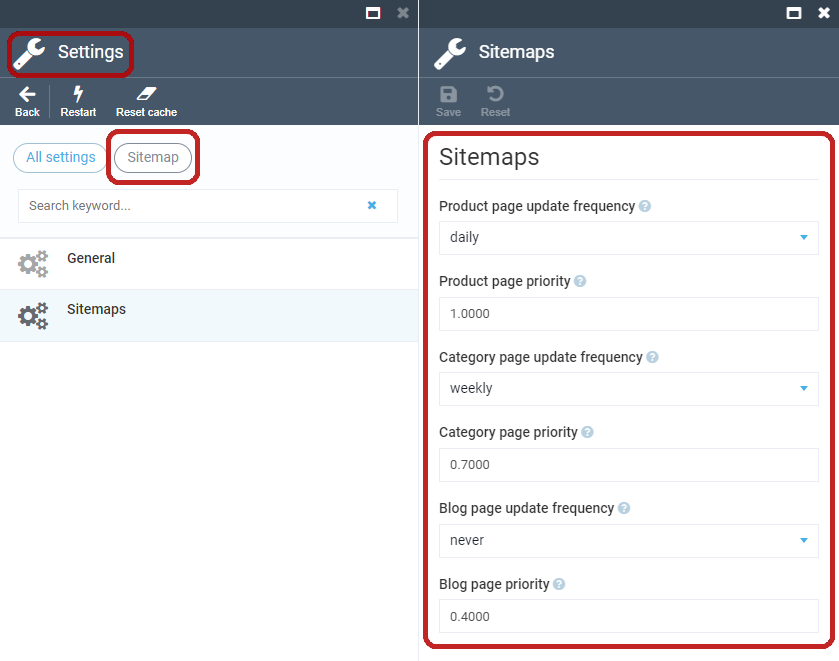
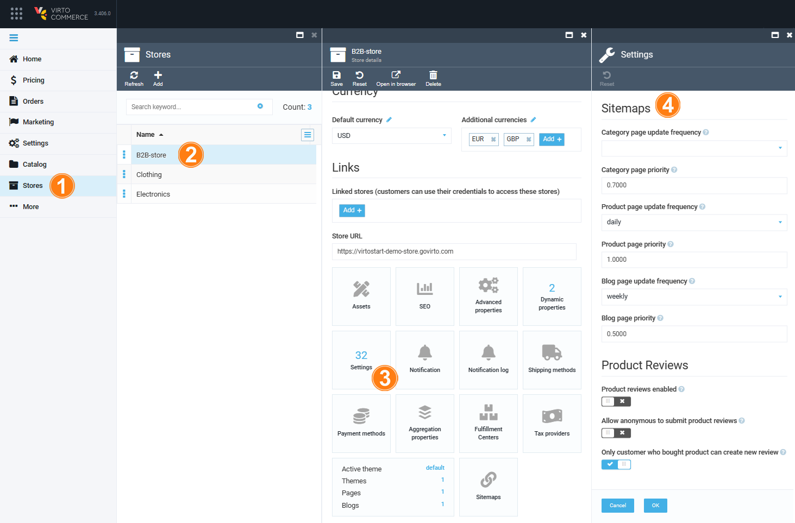

# Settings

The Virto Commerce Sitemaps module has multiple settings, each of them influencing the sitemap XML generation process. These settings are grouped into sections.

## General Settings

+ Record limit (default value:  **10000**): Sets the maximum number of URL records per sitemap file.

!!! note
	A sitemap file must not include more than 10,000 URLs and must not be larger than 50MB (52,428,800 bytes). In case the number of records exceeds the maximum, the file will be split into multiple ones, e.g., the  `products.xml`  sitemap file with 15,000 records will be transformed into  `products--1.xml`  (10,000 records) and  `products--2.xml`  (5,000 records).

+ Filename separator (default value:  **--**): Sets the sitemap location separator in case the sitemap item number exceeds the  _Record limit_  parameter value (i.e.:  `products.xml`  ->  `products--1.xml`  and  `products--2.xml`).
+ Search bunch size (default value:  **1000**): This parameter is used in the long-term search processes (i.e. catalog search) to split search requests, and sets the search request bunch size parameter.
+ Export/Import description (default value:  **Export/Import sitemaps with all sitemap items**): Sets the description for the platform export/import process.

## Blog Links

+ Blog page priority sets the value of the sitemap  `<priority>`  parameter of static pages and blogs.
+ Blog page update frequency sets the value of the sitemap  `<changefreq>`  parameter of static pages and blogs.

## Category Links

+ Category page priority (default value:  **0.7**): Sets the value of the sitemap  `<priority>`  parameter for catalog category pages.
+ Category page update frequency (default value:  **weekly**): Sets the value of the sitemap  `<changefreq>`  parameter for catalog category pages.

## Product Links

1.  Product page priority (default value:  **1.0**): Sets the value of the sitemap  `<priority>`  parameter for catalog product pages.
2.  Product page update frequency (default value:  **daily**): Sets the value of the sitemap  `<changefreq>`  parameter for catalog product pages.

These values can be set at the module level. To modify them, go to  _Settings_  and click the  _Sitemap_  module, then navigate to the  _Sitemaps_  section:

Additionally, you can also set these values [at the store level](https://docs.virtocommerce.org/new/user_docs/store/settings/#sitemaps-settings). For that, go to _Stores_, select the desired store, and click _Settings_:

!!! note
	The priority and update frequency settings at the store level have a higher priority, which means they will override the settings specified at the module level.
