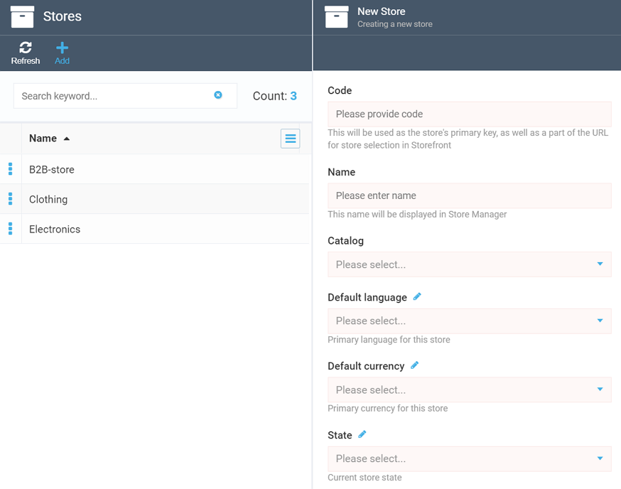
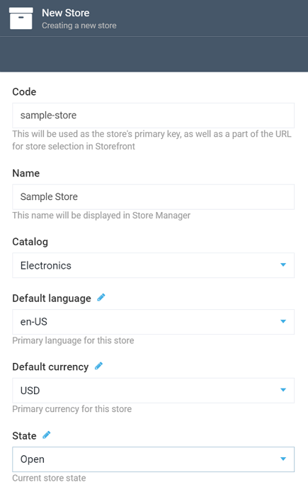
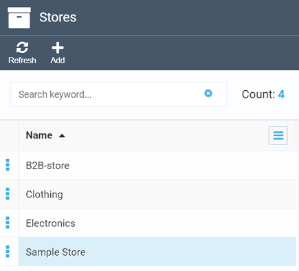

# Adding New Store
This section will guide you through the steps you need to follow to add a new store to your Virto Commerce system.

After navigating to the Store module, click the ***Add*** button, which will open the ***New Store*** screen, with all fields being required:

Fill out the fields as appropriate:

+ ***Code*** is your store's identifier, which will be also included into its URL. Your code may include only alphanumeric characters, hyphens, and underscores. The use of alphanumeric chars allows you to make your store ID meaningful to the users.

!!! note
	Once you create your store, the ***Code*** field will become uneditable, so make sure to provide a relevant and convenient one before you click ***Create***.

+ ***Name***: Give your store a name, which will be displayed in the VC system.
+ ***Catalog***: Provide a *single* [catalog](https://docs.virtocommerce.org/new/user_docs/catalog) your store will be using.
+ ***Default Language:*** Select a language your store will be available in.
+ ***Default Currency:*** Select a currency the prices in your store will be displayed in, by default.

!!! note
	You can also specify additional currencies and languages for your store, at a later stage.

+ ***State:*** The current status of your store. May be either ***Open***, ***Closed*** (no one will be able to access it), or ***Restricted*** (only specific users will have access).

For our sample store, we provided the following values:

 

Once you hit the ***Create*** button, your new store will appear in the list:

This is it. You can now start configuring your store [settings](configuring-store.md). 
