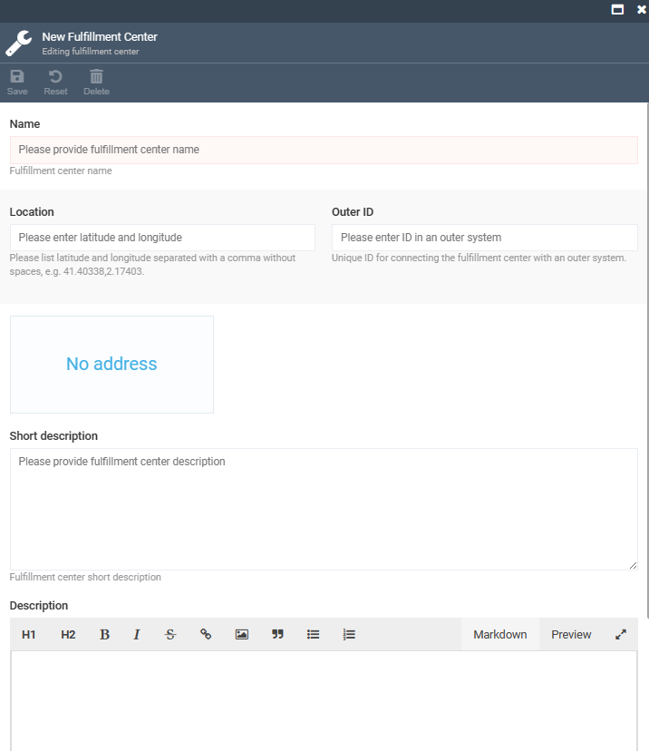

# Configure store

To configure your store, select it in the **Stores** blade and modify the following fields:

Below is additional information on some widgets.

## SEO
You can have multiple SEO sets for your store pages. Each set includes meta title, meta description, keywords, URL slug, and more:

## Fulfillment centers
You can choose a fulfillment center from a drop-down list or add a new one. For the new one, fill in the following fields:
{: width="600"}

[Read more about store settings](settings.md){ .md-button }

[Read more about notifications](../notifications/overview.md){ .md-button }

[Read more about sitemaps](../sitemaps/overview.md){ .md-button }
