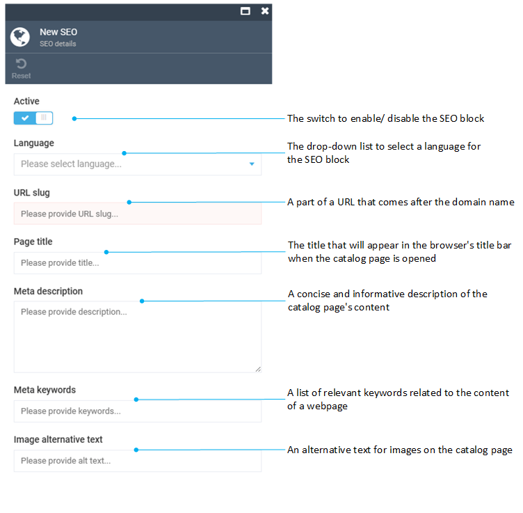

# Configuring Your Store
Once you have [created your new store](adding-new-store.md) and selected it in the store list, you will see your store screen with all settings and properties available:

As you can see, the store settings are very diverse. However, all of them are neatly grouped into two sections: fields and widgets.

## Field Settings
The field settings appear on the top part of the ***Store Details*** screen:

Here, you can:

+ Edit the store name (*not* the code)
+ Provide additional languages and currencies
+ Provide links to other stores, so that your customers may log in to all of them with the same credentials

!!! warning
	The store linking feature is still under development.

+ Specify store URL

## Widget Settings
Most additional store settings and properties are provided as widgets:

The sections below explain what each widget is about.

### Assets
This widget allows you to manage assets (product images, thumbnails, etc.) for your store. Start by uploading files directly or create one or more folders to keep everything organized.

When creating a folder, please observe the naming conventions the system will prompt you to follow.

### SEO
You can have multiple SEO sets for your store pages. Each set includes meta title, meta description, keywords, URL slug, and more:

### Advanced Properties
Here, you can provide store description and specify location settings. You can also provide email contacts for your store (both regular and admin):

### Settings
This widget houses all specific settings you can configure for your store. Each setting has a tip which tells you what it is exactly about.

The Store module allows you to manage general settings, as well as SEO, Product Review, Sitemap, Google Analytics settings, and more.

!!! tip
	You can also access some of those settings through the global [Store Settings](settings.md) menu. Those settings will apply to all stores you have. In the meantime, the settings you configure through the widget will apply to the particular store only.

### Notification and Notification Log
These widgets help you configure notifications for your store and view the notification log. These properties are borrowed from Virto's Notifications module, which we describe in detail [here](https://docs.virtocommerce.org/new/user_docs/notifications/overview/).

### Shipping and Payment Methods
You can configure and activate various shipping and payment methods for each individual store. As a user, you cannot add a new method through the Store module UI, so you will need assistance from your development team for that.

### Tax Providers
Similarly to the previous one, this widget allows you to configure and activate various tax providers for each individual store. Again, adding a new provider requires development effort.

## Conclusion
Once you are done with settings, hit the ***Save*** button. Alternatively, you can click ***Open in browser*** to see how your store will look like for customers:

