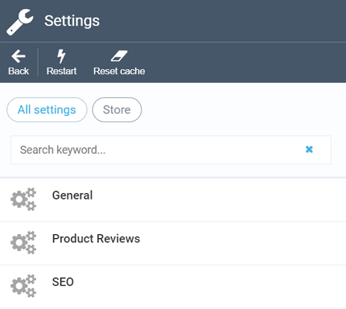
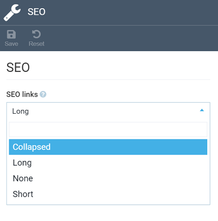

# Store Module Settings
After navigating to ***More > Settings > Store***, you will access the global settings screen for the store module:

!!! note
	The settings described in this section are global and apply to all stores you have. To manage settings of a specific store, use the [appropriate widget](configuring-store.md#settings) while configuring it.

The global settings consist of just three sections:

+ ***General***, where you can configure general options:

+ ***Product Reviews***, which allows you to enable or disable product reviews<!---link to prod reviews--> for your stores:

+ ***SEO***, which has only one setting (others are configured through the [appropriate widget](configuring-store.md#SEO):

