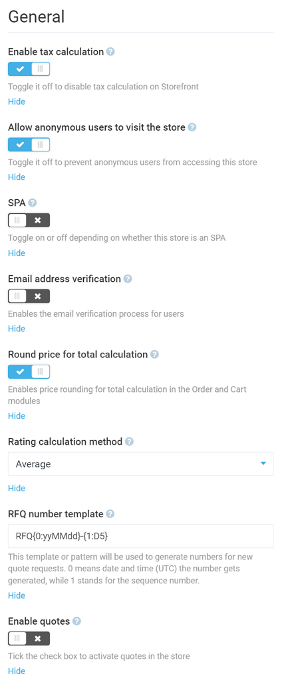
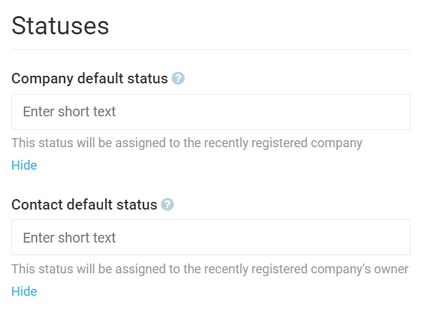
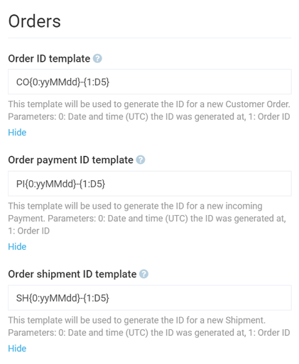
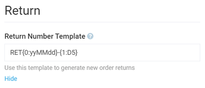
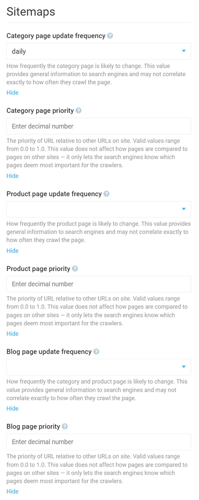
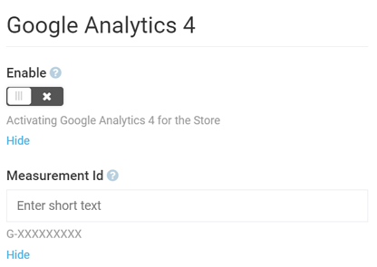
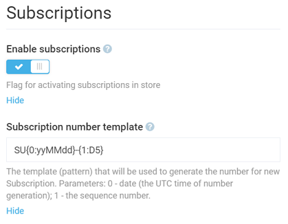

# Store Module Settings
As a user, you can specify store settings both through the [Settings widget](configuring-store.md#settings) (which will then be specific for a particular store) and by navigating to ***More > Settings > Store***, which are global settings working for all your stores.

You can find the detailed list of store settings below. Global settings will be highlighted as such.

## General Settings
General settings allow you to configure the following:

+ **Enable tax calculation (global setting):** You can enable or disable tax calculation for your store.
+ **Allow anonymous users to visit the store (global setting):** When this setting is disabled, the store will not be accessible by any users that do not have an account.
+ **SPA (global setting):** Tells the system whether the store is a single-page application. Depending on this, the system will behave in a different way to achieve maximum efficiency.
+ **Email address verification (global setting):** When this setting is enabled, the users will have to verify their email to sign up for an account.
+ **Round price for total calculation (global setting):** This setting is bound to the [Order](link-to-order-module) and [Cart](link-to-cart-module) modules and enables rounding the price up or down.
+ **Rating calculation method:** Allows you to choose rating calculation method, either average or by [Wilson formula](http://www.vernimmen.com/Practice/Formulas/Wilson_formula.html).
+ **RFQ number template:** Allows you to configure a template used to generate numbers for new quote requests.
+ **Enable quotes:** Toggles enabling or disabling [quotes](link-to-quote-module) for this store.

## SEO Settings
The ***SEO*** section houses a single **global** setting that allows you to configure the URL slug length for SEO purposes:

## Status Settings
These settings allow you to provide short statuses to the [companies and contacts](../contacts/overview.md) added to your store:

For instance, you can provide here such statuses as *Approved*, *Pending*, *In review*, etc.

## Order Settings
This section enables configuring order ID templates. The tips under the question mark icon explain what each setting is for:

## Return Settings
Technically, a single setting that enables configuring return ID template:

## Product Review Settings
These **global** settings enable the [Product Review](link-to-product-reviews) module on your store(s) and allow you to accept reviews from registered users only and/or only from actual buyers:

## Sitemaps Settings
These settings allow you to configure various options for the [Sitemaps](../sitemaps/overview.md) module applicable to your store:

## Google Analytics 4 Settings
Enables or disables GA4 for your store and allows you to provide Google-like measurement ID:

## Subscription Settings
These settings enable or disable the [Subscription](link-to-subscription) module on your store and allow you to specify the subscription number template:

