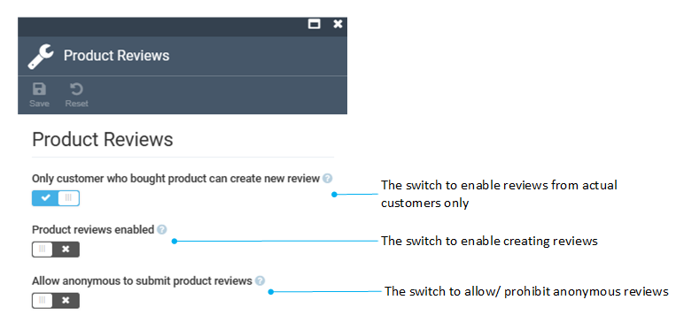

# Store module settings

You can configure Store module settings through:

* Settings widget in the **Store details blade** (**Stores -->Your store -->Settings**).
* Settings module in the main menu (**Settings-->Store**).

In both the widget and the settings module, you will find the following global settings:

* General settings:

    

* SEO settings:

    

* Product reviews settings:

    

Additionally, within the widget, there are other store-specific settings:

* [Orders templates settings](../order-management/settings.md#orders-templates-settings).
* Subscriptions settings.
* Hotjar and Google Analytics settings.
