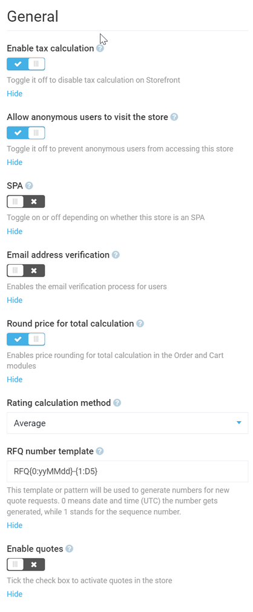

# Store Module Settings
As a user, you can specify store settings both through the [Settings widget](configuring-store.md#settings) (which will then be specific for a particular store) and by navigating to ***More > Settings > Store***, which are global settings working for all your stores.

You can find the detailed list of store settings below. Global settings will be highlighted as such.

## General Settings
General settings allow you to configure the following:

+ **Enable tax calculation:** You can enable or disable tax calculation for your store.
+ **Allow anonymous users to visit the store:** 