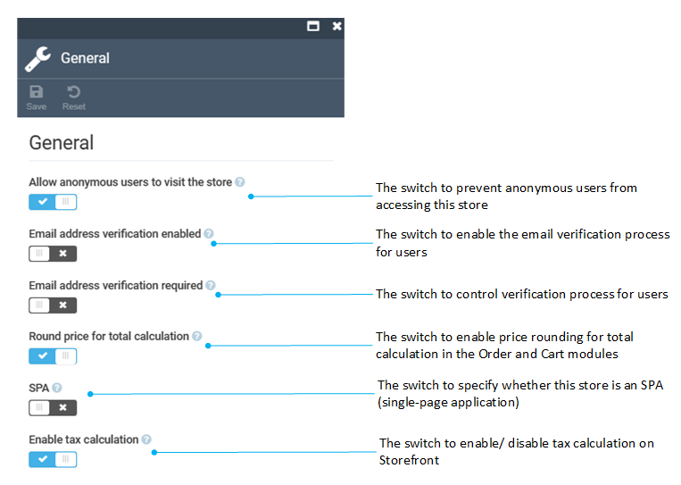

# Store module settings

To configure the store-specific settings, use the **Settings** widget in the **Store details blade**.

To configure global settings:

1. Click **Settings** in the main menu.
1. In the search field of the next blade, type **Store** to find the settings related to the module.
1. Select: 
    * [General settings](settings.md#general-settings)
    * [Product reviews settings](settings.md#product-reviews-settings)
    * [SEO settings](settings.md#seo-settings)

## General settings

Configure the following settings:

## Product reviews settings

Configure the following settings:

## SEO settings
In this section, you can configure the URL slug length for SEO purposes:

