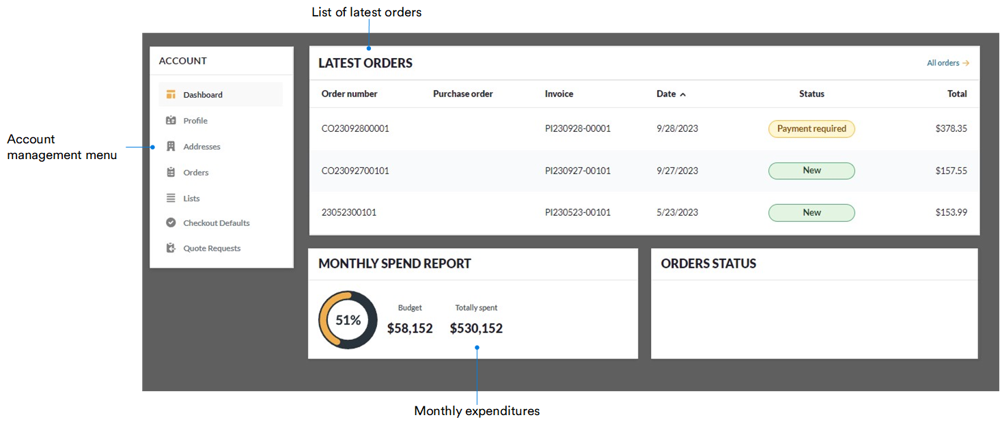

# Dashboard

Both personal and corporate accounts open with the **Dashboard** menu item. Within this section, users can efficiently navigate to any listed orders or access various account menu items. Additionally, essential information such as order numbers, relevant invoices, creation dates, total amounts, and statuses is present. The monthly spending report provides an overview of expenditures for the current month and their relation to the total planned budget. Note that the **Dashboard** feature is not available in the mobile version.

