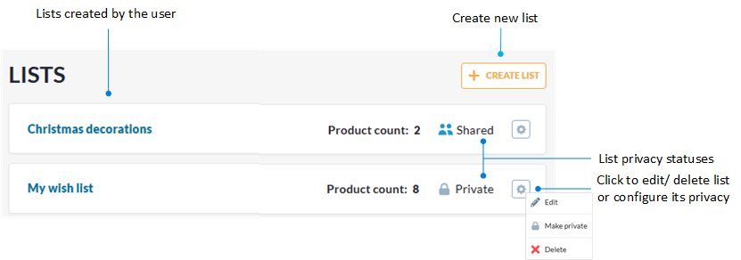
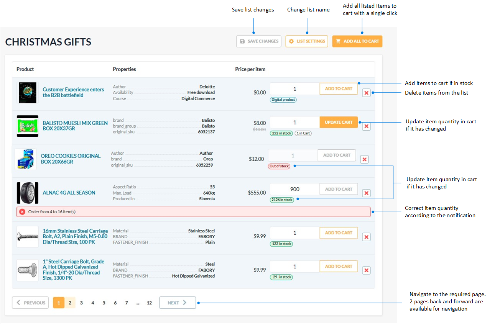

# Lists

The lists help users save items they are interested in for future consideration. The **Lists** section contains all the product lists created by the user. You can also quickly access the **Lists** section through the **Lists** button in the top menu. 

In the **Lists** section, you can:

* Create new lists.
* Edit lists names.
* Delete lists.

{: width="850"}

Click on the desired list to view its details. Here you can:

* Add all the listed items to cart with a single click.
* Add specific listed items to cart.
* Update the amount of items in cart.
* Delete items from the list.

