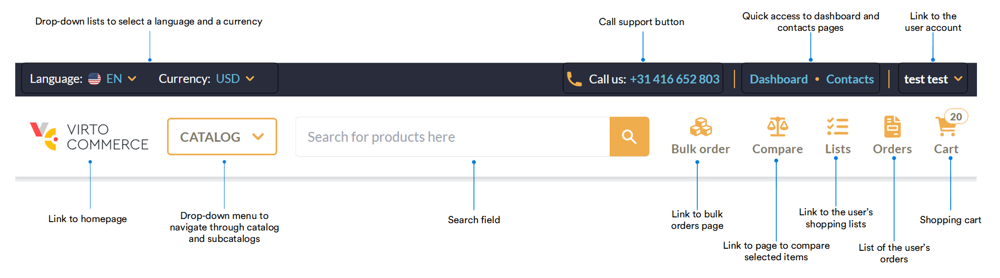
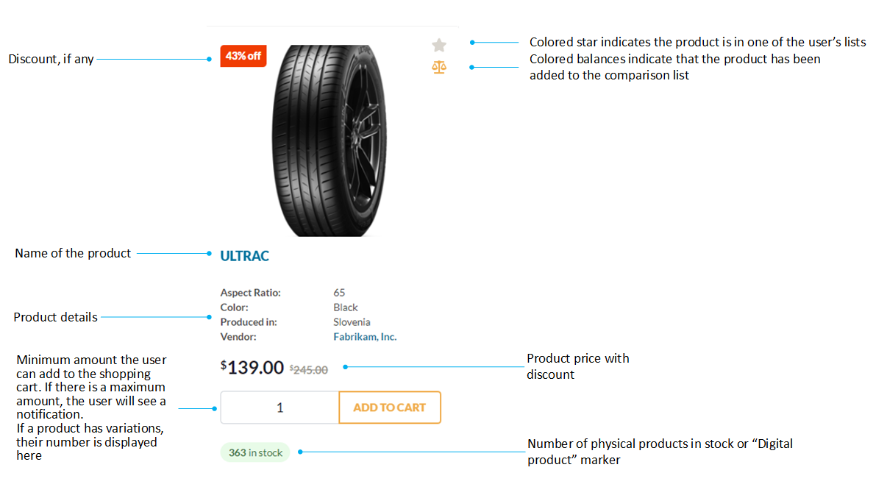

# Homepage layout

The homepage can be visually divided into 3 parts:

* [Top menu](homepage-layout.md#top-menu)
* [Catalogs, subcatalogs, and facets](homepage-layout.md#catalogs-subcatalogs-facets)
* [Catalog items details](homepage-layout.md#catalog-items-details)

## Top menu

From the top menu, you can:

* Access your account profile.
* Select language and currency to display prices in.
* Search for products by their name or SKU, and more.

Read more about [Bulk orders.](../shopping/bulk-orders.md)

Read more about [Comparing products.](../shopping/compare-products.md)

## Catalogs, subcatalogs, facets

From the left side menu, you can:

* Quickly navigate to the required subcatalog.
* Narrow down the number of items displayed by specifying the required product characteristics in the facets.

Read more about [Search options](../shopping/searching-for-products.md).

## Catalog items details

In this area, you can:

* Switch between grid view and list view of the catalog items.
* Check the availability of the products in the selected branches.
* Sort products by price or name.
* View product details, etc.

Each product card displays:

* Product name and its basic characteristics.
* Its quantity in stock.
* Discounts applied, etc. 

