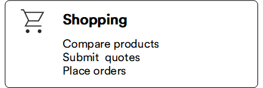

# Overview

This guide is designed to help you navigate and make the most of your shopping experience on our platform. Youv will find valuable information on how to browse products, manage your account, place orders, and much more. 

[Public demo site ](https://vcst-demo-storefront.paas.govirto.com/){ .md-button }

[Install Storefront](https://github.com/VirtoCommerce/vc-theme-b2b-vue){ .md-button }
